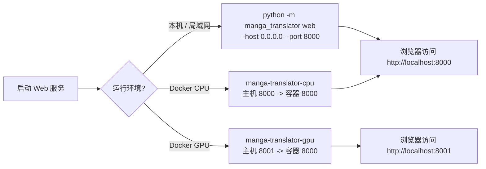
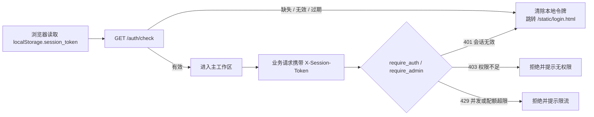

# Web 部署、安全与排错

当需要把 Web 界面部署到本机、局域网或 Docker，确认会话令牌、限流与权限边界，或遇到“端口被占用”“局域网无法访问”“登录被限流”等问题时使用本页。本页只覆盖 Web 服务的部署、安全边界与排错；账号、权限与 API Key 的具体操作见[账号、权限与 API 密钥](./accounts-permissions-and-api-keys.md)，登录与会话的界面操作见[登录、语言与会话](./login-language-and-session.md)，管理控制台见[管理员界面](./administrator-interface.md)。完整的 HTTP 路由、状态码与端口契约属于开发者文档，见[Web 服务器端口与部署](../developer/web-server-ports-and-deployment.md)与[鉴权与错误](../developer/http-api/authentication-and-errors.md)。

## 功能边界

- Web 服务同时提供用户界面（`GET /`）、管理界面（`GET /admin`）、登录页（`/static/login.html`）和开发者 HTTP API；本页只讲面向使用者的部署、安全边界与排错，不重复开发者 API 契约。
- 默认监听 `0.0.0.0:8000`，可用 `--host`/`--port` 或环境变量 `MT_WEB_HOST`/`MT_WEB_PORT` 覆盖；`0.0.0.0` 表示监听所有 IPv4 接口，不是浏览器访问地址。
- Docker Compose 提供 CPU 与 GPU 两个服务：CPU 版映射 `8000:8000`，GPU 版映射 `8001:8000`。
- 会话、权限、限流与审计都在服务端强制执行；浏览器隐藏控件或删除前端令牌不能替代服务端检查。
- 本页不记录真实密码、令牌、API Key、用户名或私有路径，也不展示 `.env` 明文。

## 部署方式 {#deploy-methods}

### 本机或局域网运行

在项目根目录执行 `uv run python -m manga_translator web`（已安装环境下也可运行 `python -m manga_translator web`）。默认监听 `0.0.0.0:8000`；只允许本机访问时建议改用 `--host 127.0.0.1`。

| 参数 | 默认值 | 说明 |
| --- | --- | --- |
| `--host` / `MT_WEB_HOST` | `0.0.0.0` | 监听地址；`127.0.0.1` 仅本机，`0.0.0.0` 允许局域网客户端连接 |
| `--port` / `MT_WEB_PORT` | `8000` | 监听端口 |
| `--use-gpu` / `MT_USE_GPU` | 关闭 | 是否使用 GPU 加速 |
| `--models-ttl` / `MT_MODELS_TTL` | `0` | 模型在内存中的保留秒数，`0` 表示一直保留；Compose 模板设为 `300` |
| `--retry-attempts` / `MT_RETRY_ATTEMPTS` | 未设置时为 `None`（使用 API 传入配置）；显式 `-1` 表示无限重试 | 翻译失败重试次数 |
| `-v` / `MT_VERBOSE` | 关闭 | 详细日志 |

浏览器访问地址：本机为 `http://127.0.0.1:8000`；局域网客户端必须使用服务器实际局域网 IP，例如 `http://192.168.x.x:8000`，并放行系统防火墙对应端口。是否真正对外可达取决于防火墙、端口映射和网络环境，不能由监听地址断言。

### Docker CPU 与 GPU

`packaging/docker-compose.yml` 定义两个服务：

| 服务 | 镜像 | 端口映射 | GPU | 内存限制（模板示例） |
| --- | --- | --- | --- | --- |
| `manga-translator-cpu` | `manga-translator:cpu` | `8000:8000` | 关闭 | 上限 8G / 预留 2G |
| `manga-translator-gpu` | `manga-translator:gpu` | `8001:8000` | 开启 | 上限 16G / 预留 4G |

容器内服务始终监听 `8000`；主机访问入口分别是 `8000`（CPU）与 `8001`（GPU），不要把 GPU 版误写成容器内默认端口。Compose 通过 `MANGA_TRANSLATOR_ADMIN_PASSWORD` 设置首次启动的管理员密码（模板内含示例占位值，生产环境必须修改），并传入 `MT_USE_GPU`、`MT_MODELS_TTL`、`MT_RETRY_ATTEMPTS`、`MT_VERBOSE` 等环境变量。

Compose 把 `./data/fonts`、`./data/dict`、`./data/result`、`./data/models`、`./data/logs`、`./data/server`、`./data/config` 挂载为卷；要让 Web 管理界面保存的服务器 API Key 在重建容器后保留，需要先创建空文件 `./data/app.env` 并取消 `.env` 卷挂载注释。容器入口脚本 `packaging/docker-entrypoint.sh` 在对应卷为空时，从镜像内置的 `default_config`、`default_fonts`、`default_dict`、`default_server_data` 恢复默认内容，因此“清空卷”会回到默认状态而不是报错。

容器健康检查每 30 秒请求一次 `http://localhost:8000/`，启动期 60 秒、最多重试 3 次；首次启动若在初始化服务或加载模型，健康检查短暂失败属正常现象。

## 安全边界 {#security-boundary}

### 会话令牌与认证

登录成功后服务端创建会话：令牌由 `secrets.token_urlsafe(32)` 生成，会话记录在 `manga_translator/server/data/sessions.json`（启用持久化时），不活动超过 60 分钟自动过期。浏览器把令牌保存在 `localStorage.session_token`，后续请求通过 `X-Session-Token` 请求头发送；`/auth/check` 失败或业务请求返回 `401` 时，前端清除本地令牌并跳转登录页。

会话安全服务（`session_security_service.py`）提供所有权与反枚举保护：

- 会话所有权令牌使用 UUID v4（128 位随机）；格式不合法直接拒绝。
- 同一用户 5 分钟内失败访问超过 10 次触发限流，防止暴力枚举令牌。
- 普通用户只能访问自己名下的会话；管理员可以查看全部会话。
- 每次拒绝都写入访问尝试日志，供审计查询。

### 限流与配额

| 场景 | 限流口径（源码） | 超限返回 |
| --- | --- | --- |
| 登录 `/auth/login` | 每 IP 10 分钟 15 次；每用户名 10 分钟 8 次 | `429` + `Retry-After` |
| 注册 `/auth/register` | 每 IP 10 分钟 5 次 | `429` + `Retry-After` |
| 旧密码门 `/user/login` | 每 IP 10 分钟 10 次 | `429` + `Retry-After` |
| 并发任务 / 每日配额 | 按用户或用户组生效的并发上限与每日配额 | `429` |

### 权限边界

- `require_auth` 验证令牌、刷新活动时间，并拒绝不存在、过期或已停用账号（`401`）。
- `require_admin` 在此基础上要求 `role == 'admin'`；非管理员访问管理端点返回 `403`。
- 翻译端点还会校验翻译器、OCR、上色器、渲染器权限，并对用户提交的参数做服务端过滤，未授权参数被静默丢弃。
- 下载票据是短时令牌（默认 5 分钟），`GET|HEAD /api/history/downloads/t/{ticket}` 不读取会话头，只依赖票据本身；无效或过期票据返回 `404`。
- CORS 源码配置为 `allow_origins=["*"]` 且 `allow_credentials=True`。这是服务端配置，不代表浏览器会在所有 origin/credential 组合下放行；对外部署时建议用反向代理收紧来源，并做浏览器预检运行验证。

### 凭据与敏感信息

- 首次启动没有账号时，登录页进入“初始设置”：创建第一个管理员账户（用户名至少 2 字符、密码至少 6 字符）；账号被标记 `must_change_password` 时登录后强制改密。
- 是否开放注册由管理端“允许用户注册”开关控制，默认关闭；未开启时注册请求返回 `403`。
- 管理端“服务器默认API密钥”对应 `.env`；`/env` 与 `/env/effective` 不返回服务器密钥明文，前端只显示“已保存”类状态。
- “API Keys (.env)”页签默认隐藏，是否显示与可编辑由登录状态和权限策略决定；用户输入暂时保存在浏览器 `localStorage.user_env_vars`。
- 部署或分享排错信息前，删除日志、错误消息、票据、令牌、`.env` 内容、私有路径和用户图片。Docker Compose 模板中的管理员密码是示例占位值，生产必须替换。

## 常见问题 {#troubleshooting}

| 现象 | 常见原因 | 处理 |
| --- | --- | --- |
| 启动报“端口被占用 / address already in use” | `8000` 已被其他进程占用 | 换用 `--port 8001` 或设置 `MT_WEB_PORT`；Windows 可用 `netstat -ano` 定位占用进程 |
| 局域网设备无法访问 | 监听地址是 `127.0.0.1`，或防火墙未放行端口，或使用了错误的 IP | 确认 `--host 0.0.0.0`、放行防火墙、使用服务器实际局域网 IP |
| Docker GPU 版访问不到 | 用了容器内默认端口 `8000` | 主机入口是 `8001`，对应 Compose 映射 `8001:8000` |
| 登录频繁失败后提示“尝试过于频繁” | 触发了登录限流 | 等待 `Retry-After` 指示的时间后再试；不要在文档或公开日志中记录真实密码 |
| 页面跳回登录页 | 会话过期（60 分钟无活动）、令牌失效或本地存储被清空 | 重新登录；清空站点数据后令牌不存在属正常行为 |
| 管理界面或操作返回 `403` | 当前账号不是管理员或缺少对应权限 | 用管理员账号登录，或由管理员在用户/用户组中授予权限 |
| 批量任务返回 `499` | 任务被取消或检测到取消 | 重新发起任务；取消是用户操作，不是服务崩溃 |
| 请求返回 `422` | 请求体未通过 FastAPI 校验 | 检查字段类型与必填项；响应包含 `detail` 与请求 body 字符串 |
| Docker 健康检查红灯 | 服务仍在初始化、模型加载中或端口映射错误 | 查看 `docker logs`，确认主机端口与容器 `8000` 的映射关系 |
| 容器启动后配置/字体/数据“变回默认” | 挂载卷为空，入口脚本恢复了默认内容 | 这是设计行为；不要删除卷中的 `admin_config.json`、`accounts.json` 等文件 |

状态码的完整矩阵与触发来源见[鉴权与错误](../developer/http-api/authentication-and-errors.md)；翻译、导入导出等请求错误的详细解释见[翻译端点](../developer/http-api/translation-endpoints.md)。

## UI 文案对照 {#ui-copy}

Web 页面同时使用桌面 locale 文件（经 `/i18n/{locale}` 读取，另有条件挂载的 `/locales/{locale}`）与 HTML/JS 硬编码文本。以下为与部署、登录、安全相关的样本；`script.js` 中缺失的 key 会回退到调用处的硬编码默认值，不视为已本地化文案。

| UI 调用 key | English 实际值 | 简体中文实际值 |
| --- | --- | --- |
| `Manga Translator` | Manga Translator | 漫画翻译器 |
| `Add Files` / `Clear List` | Add Files / Clear List | 添加文件 / 清空列表 |
| `Translation Workflow Mode:` / `Start Translation` | Translation Workflow Mode: / Start Translation | 翻译流程模式：/ 开始翻译 |
| `Basic Settings` / `Advanced Settings` / `Options` | Basic Settings / Advanced Settings / Options | 基础设置 / 高级设置 / 选项 |
| `API Keys (.env)` / `Log output...` | API Keys (.env) / Log output... | API密钥 (.env) / 日志输出... |
| `Export Config` / `Import Config` | Export Config / Import Config | 导出配置 / 导入配置 |
| `admin` | 缺失，使用调用处 fallback | 缺失，使用调用处 fallback（“管理”） |
| `env_hint` | API key input fields will appear below based on the selected translator | 根据选择的翻译器，下方会显示所需的 API 密钥输入框 |
| `env_var_saved` / `env_var_save_failed` | API key saved / Failed to save API key | API密钥已保存 / API密钥保存失败 |
| `save_api_keys` | 缺失，使用调用处 fallback | 缺失，使用调用处 fallback（“保存 API 密钥”） |
| `api_keys_will_be_saved` / `api_keys_session_only` | 缺失，使用调用处 fallback | 缺失，使用调用处 fallback（“API 密钥将保存到服务器”/“API 密钥仅在本次会话中使用，不会保存到服务器”） |
| `login_required_for_api_keys` | 缺失，使用调用处 fallback | 缺失，使用调用处 fallback（“登录后可查看和保存 API 密钥”） |

登录页（`static/login.html`）与管理控制台（`admin-new.html`）的主体文案是 HTML 硬编码中文，没有 i18n key，例如“管理员用户名”“创建管理员账户”“管理控制台”“会话管理”“服务器配置”；英文界面需要在未来 i18n 阶段逐项核对，本页不擅自补译。

## 关联文件与格式 {#related-files}

| 文件/目录 | 本页实际作用 | 注意 |
| --- | --- | --- |
| `manga_translator/server/data/` | 服务端数据目录：`accounts.json`、`sessions.json`、`admin_config.json`、`audit.log`、`permissions.json`、`translation_history.json`、`results/`、`user_resources/` | Docker 中对应卷 `./data/server`；不要提交或分享其中的真实账号、令牌与审计内容 |
| `admin_config.json`（旧路径 `manga_translator/server/admin_config.json` 自动迁移） | 管理端设置：管理员密码、注册开关、API Key 策略、上传限制 | 首次启动可被 `MANGA_TRANSLATOR_ADMIN_PASSWORD` 环境变量初始化（最少 6 字符） |
| `.env` | 服务器端 API Key 等环境变量 | `/env` 不返回明文；Compose 需显式挂载 `./data/app.env` 才能持久化 |
| `config/config.json` | Web 默认配置（由模板生成） | 用户导入配置会覆盖内存设置 |
| `packaging/Dockerfile`、`packaging/docker-compose.yml`、`packaging/docker-entrypoint.sh` | 镜像构建、端口/卷/健康检查与默认数据恢复 | 生产部署应修改示例管理员密码与内存限制 |
| `manga_translator/server/static/` | 前端页面与脚本：`index.html`、`login.html`、`admin-new.html`、`script.js`、`js/i18n.js` | 页面文字混合 locale key 与硬编码文本 |

## 源码依据 {#source-evidence}

| 层级 | 文件 | 本页核对内容 |
| --- | --- | --- |
| 部署 | `packaging/Dockerfile`、`packaging/docker-compose.yml`、`packaging/docker-entrypoint.sh` | CPU/GPU 端口映射、环境变量、卷、健康检查、默认数据恢复 |
| 启动与端口 | `manga_translator/args.py`、`manga_translator/server/main.py` | `MT_WEB_HOST`/`MT_WEB_PORT` 默认 `0.0.0.0:8000`、CORS、静态挂载、Uvicorn 超时 |
| 认证/授权 | `manga_translator/server/core/middleware.py`、`routes/auth.py`、`routes/web.py` | `require_auth`/`require_admin`、401/403/429、登录/注册/旧密码门限流 |
| 会话安全 | `manga_translator/server/core/session_service.py`、`session_security_service.py` | token 生成、60 分钟超时、UUID v4 校验、所有权、反枚举限流、审计 |
| 下载票据 | `manga_translator/server/core/download_ticket_service.py` | 短时票据、默认 5 分钟 TTL、过期清理 |
| 前端 | `manga_translator/server/static/script.js`、`js/i18n.js`、`login.html`、`admin-new.html` | `localStorage.session_token`、`X-Session-Token`、`/auth/check` 跳转、locale 加载与回退 |
| 管理设置 | `manga_translator/server/core/config_manager.py`、`server_paths.py` | `MANGA_TRANSLATOR_ADMIN_PASSWORD`、`admin_config.json` 路径与迁移 |

## 验证记录 {#verification}

| 验证内容 | 状态 | 说明 |
| --- | --- | --- |
| BLUEPRINT、PAGE_GUIDELINES、TODO | 完成 | 已完整读取并按页面合同编写；未修改 TODO.md |
| 部署与端口 | 完成 | 静态核对 Dockerfile、docker-compose.yml、args.py、main.py |
| 安全边界 | 完成 | 静态核对 middleware、auth.py、session_security_service.py、download_ticket_service.py |
| UI 文案三列 | 完成 | 逐项核对 `en_US.json`/`zh_CN.json` 与 script.js 调用处 fallback |
| 路由镜像 / 源码依据脚本 | 完成 | `node scripts/verify-route-mirror.mjs .` 与 `node scripts/verify-source-evidence.mjs .` 通过 |
| 脱敏运行验证 | 待后续 | 未启动服务、未读取真实 `.env`、账号、令牌、用户图片或私有路径 |
| VitePress 构建 | 待运行 | 由协调代理在合并前运行 `npm run docs:build --prefix doc/wiki` |
