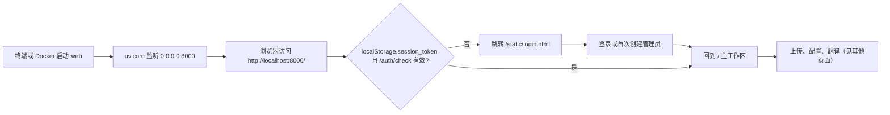

# Web 启动与访问

当需要把 Manga Translator 作为 Web 服务运行，并通过浏览器上传图片、配置参数和查看结果时，使用本页。正式 `web` 子命令在同一进程内提供用户界面（`GET /` 主工作区、`GET /admin` 管理界面和 `/static/*` 静态资源）和开发者 HTTP API；本页只覆盖“启动服务 + 浏览器访问”这条用户路径。登录、会话、注册和语言切换的完整操作见[登录、语言与会话](./login-language-and-session.md)，上传与翻译操作见[上传配置与翻译](./upload-config-and-translate.md)，HTTP API 契约与内部 `ws`/`shared` 协议分别见开发者页面和[CLI Web、WS 与 Shared 模式](../cli/web-ws-and-shared-modes.md)。

## 功能边界 {#feature-boundary}

- 正式入口是 `python -m manga_translator web`；默认监听 `0.0.0.0`、默认端口 `8000`，可用 `MT_WEB_HOST`/`MT_WEB_PORT` 环境变量或 `--host`/`--port` 参数覆盖。`manga_translator/server/args.py` 里另有一套未被正式顶层解析器使用的 `127.0.0.1:8000` 解析器，不能据此改写正式默认值。
- `web`、`local`、`ws`、`shared` 是并列子命令：`local` 是命令行批量翻译，不监听端口；`ws`（本地监听 `127.0.0.1:5003`、上游 `ws://localhost:5000`）和 `shared`（`127.0.0.1:5003`）是内部执行器协议，浏览器不直接访问。
- 本页属于 Web 用户端：`GET /` 的普通用户界面、`GET /admin` 的管理界面和 `static/login.html` 的会话入口。所有 JSON、表单和流式端点归开发者 HTTP API 页面，即使静态前端会调用其中一部分。
- 默认 `0.0.0.0` 表示监听所有网卡：本机、局域网和端口映射都能访问，也意味着服务默认暴露在网络上。

## 启动 Web 服务 {#start-web-server}

### 通过命令行启动 {#start-via-cli}

在仓库根目录使用项目受管运行时：

```powershell
uv run --no-sync python -m manga_translator web
```

该命令等价于默认值 `--host 0.0.0.0 --port 8000`。启动过程中：

1. `__main__.py` 在解析参数前尝试导入 `torch`；PyTorch 缺失或 DLL 不兼容时，可能连帮助输出都会失败。
2. 读取应用目录下的 `.env`（存在时加载，只打印已加载 key 的名称，不打印值）；找不到时打印警告。
3. 初始化服务器配置和数据目录（`manga_translator/server/data` 下的 admin 配置、用户资源目录），然后由 Uvicorn 监听 `host:port`，`timeout_keep_alive=1800`（保持连接 30 分钟）、优雅关闭超时 30 秒。
4. 打印 `[SERVER CONFIG]` 摘要和内部 nonce（用于 shared 执行器注册；不要把该值复制进公开报告）。

`web` 子命令选项（环境变量在进程启动时求值，优先级高于帮助文本中的基准值）：

| 选项 | 环境变量 | 默认值 | 作用 |
| --- | --- | --- | --- |
| `--host` | `MT_WEB_HOST` | `0.0.0.0` | 监听地址 |
| `--port` | `MT_WEB_PORT` | `8000` | 监听端口 |
| `--use-gpu` | `MT_USE_GPU` | `false` | 启用 GPU（`true`/`1`/`yes`/`on` 为真） |
| `--disable-onnx-gpu` | `MT_DISABLE_ONNX_GPU` | `false` | 禁用 ONNX Runtime GPU（同一真值规则） |
| `--models-ttl` | `MT_MODELS_TTL` | `0` | 模型保留秒数；`0` 表示永久 |
| `--retry-attempts` | `MT_RETRY_ATTEMPTS` | `None` | 失败重试次数；`-1` 表示无限 |
| `-v`, `--verbose` | `MT_VERBOSE` | `false` | 详细日志（`true`/`1`/`yes` 为真） |

例如只在本机监听并改用端口 `8080`：

```powershell
uv run --no-sync python -m manga_translator web --host 127.0.0.1 --port 8080
```

注意：直接运行 `python manga_translator/server/main.py` 会导入不存在的 `manga_translator.args.parse_arguments`，这不是正式入口；请始终使用 `python -m manga_translator web`。

### 通过 Docker 启动 {#start-via-docker}

`packaging/docker-compose.yml` 提供 CPU 与 GPU 两个服务，容器内都监听 `8000`，主机映射不同：

| 服务 | 镜像 | 主机映射 | 主机访问地址 |
| --- | --- | --- | --- |
| `manga-translator-cpu` | `manga-translator:cpu` | `8000:8000` | `http://localhost:8000` |
| `manga-translator-gpu` | `manga-translator:gpu` | `8001:8000` | `http://localhost:8001` |

Dockerfile 声明 `EXPOSE 8000`，启动命令为 `python -m manga_translator web --host 0.0.0.0 --port 8000`。compose 为首次启动设置管理员密码环境变量（示例值，暴露到网络前必须修改，本页不展示真实值），并把 `fonts`、`dict`、`result`、`models`、`logs`、`manga_translator/server/data`、`config` 挂载为数据卷；`.env` 持久化需要显式挂载 `data/app.env`。镜像构建、升级与卸载见[安装：Docker](../install/docker.md)。

## 浏览器访问 {#browser-access}

启动成功后，在浏览器地址栏输入：

| 场景 | 地址 |
| --- | --- |
| 本机 CLI | `http://localhost:8000/` 或 `http://127.0.0.1:8000/` |
| 局域网 | `http://<服务器 IP>:8000/`（`0.0.0.0` 监听所有网卡） |
| Docker CPU | `http://localhost:8000/` |
| Docker GPU | `http://localhost:8001/` |

`GET /` 由 `routes/web.py` 返回 `static/index.html`；文件缺失时返回占位 HTML “Web UI not installed”。`/static/*` 由 StaticFiles 挂载，`/locales/*` 在 `desktop_qt_ui/locales` 目录存在时也会挂载；`GET /admin` 返回 `admin-new.html`（只有管理员账号才显示入口链接）。

### 首次访问与登录入口 {#first-access-and-login}

主脚本 `script.js` 在页面加载时读取 `localStorage.session_token` 并调用 `GET /auth/check`：

- 无 token、请求失败或 `valid=false`：清除本地 token，跳转到 `/static/login.html`。
- `login.html` 先调用 `GET /auth/status`：没有任何用户时返回 `need_setup=true`，页面显示“首次使用，请创建管理员账户”；已有账号且管理员开启注册时显示登录/注册页签，否则只显示登录。
- 登录成功后 token 写入 `localStorage.session_token`，回到 `/` 进入主工作区。



该图只描述源码确认的会话检查分支；`need_setup`、注册开关、强制改密和旧式密码门等状态属于[登录、语言与会话](./login-language-and-session.md)，不在这里展开。

### 语言与界面入口 {#language-and-ui-entry}

主界面头部提供语言选择下拉框，选择值写入 `localStorage.locale`，页面从 `/i18n/{locale}` 拉取桌面 locale JSON 后应用翻译；加载失败时回退到 `/i18n/en_US`。默认语言按 `localStorage.locale` → 浏览器语言（en/zh/ja/ko/es 前缀）→ `zh_CN` 的顺序决定。页面标题和头部 H1 使用 locale key `Manga Translator`，i18n 加载前回退为 HTML 标题 “Manga Translator Web UI”。

## 端口与外部暴露 {#ports-and-exposure}

| 场景 | 端口 | 文档口径 |
| --- | --- | --- |
| Web（正式 `web` 子命令） | `0.0.0.0:8000`（`MT_WEB_HOST`/`MT_WEB_PORT` 可覆盖） | 用户界面与 HTTP API 共用，浏览器访问入口 |
| Docker CPU | 容器监听 `8000`，映射 `8000:8000` | 主机入口 `8000` |
| Docker GPU | 容器监听 `8000`，映射 `8001:8000` | 主机入口 `8001`，不是容器内默认 `8000` |
| `ws` 内部 | 本地监听 `127.0.0.1:5003`；上游 `ws://localhost:5000` | 内部协议，浏览器不直接访问；见 CLI 与开发者页面 |
| `shared` 内部 | `127.0.0.1:5003` | 内部协议；见开发者页面 |

CORS 源码配置为 `allow_origins=["*"]`、`allow_credentials=True` 且放行全部方法和头；这是服务端配置，不代表浏览器在所有 origin/credential 组合下都会放行，真实预检行为需要运行验证。

## 界面文案对照 {#ui-copy}

本页涉及的界面文案分两类：桌面 locale 中实际存在的 key，以及 HTML 硬编码字符串。下表中 locale 实际值按“调用 key → `en_US` → `zh_CN`”记录：

| UI 调用 key | English 实际值 | 简体中文实际值 |
| --- | --- | --- |
| `Manga Translator` | Manga Translator | 漫画翻译器 |

主界面头部语言下拉框的六个选项在 `index.html` 中硬编码为各语言自称，没有桌面 locale key；选择值写入 `localStorage.locale` 并发送到 `/i18n/{locale}`：

| 存储值（`localStorage.locale`） | HTML 实际文字（硬编码） |
| --- | --- |
| `zh_CN` | 简体中文 |
| `zh_TW` | 繁體中文 |
| `en_US` | English |
| `ja_JP` | 日本語 |
| `ko_KR` | 한국어 |
| `es_ES` | Español |

登录页与管理链接等硬编码文案（缺失 locale key 时 `t()` 使用调用处 fallback）：

| 位置 | 实际显示文本 |
| --- | --- |
| `script.js` 页面标题 fallback | `Manga Translator Web UI`（i18n 加载后中文显示“漫画翻译器”） |
| `login.html` 页面标题 | `用户登录 - Manga Translator` |
| `login.html` 首次设置副标题 | `首次使用，请创建管理员账户` |
| `login.html` 登录副标题 | `请登录以继续使用` |
| 管理链接 key `admin` | 非 locale key，`t('admin', '管理')` 回退为“管理” |
| `routes/web.py` 占位响应 | `Web UI not installed` |

## 依赖与安全注意事项 {#dependencies-and-security}

- 默认监听 `0.0.0.0` 意味着局域网可访问；如需仅本机使用，请用 `--host 127.0.0.1`。Windows 防火墙可能拦截局域网入站，需要放行对应端口。
- Docker compose 中的管理员密码是示例值，任何暴露到网络前的部署都必须修改；本页不展示真实密钥、令牌或用户名。
- 服务启动会读取应用目录下的 `.env` 和 `manga_translator/server/data` 下的 admin 配置；文档不读取、不展示这些真实文件内容，也不复制日志中打印的 nonce。
- 浏览器把 `session_token`、`locale`、`user_env_vars` 等保存在 `localStorage`；它们不是服务器历史记录，清空浏览器数据会丢失本地状态（详见进度、结果与历史页）。
- `python -m manga_translator` 在解析参数前导入 PyTorch；缺少 PyTorch 或 DLL 不兼容时可能无法启动，属于环境问题而非参数错误。
- 不要用浏览器直接访问 `ws`/`shared` 端口；它们需要 nonce/secret 和内部协议。

## 关联文件 {#related-files}

| 文件 | 本页作用 | 注意 |
| --- | --- | --- |
| `manga_translator/args.py` | 正式 `web` 子命令及 `MT_WEB_HOST`/`MT_WEB_PORT` 默认值 | `server/args.py` 的独立解析器不参与正式入口 |
| `manga_translator/__main__.py` | 模式分发，`web` → `run_server` | 解析参数前导入 torch |
| `manga_translator/server/main.py` | Uvicorn 启动、静态 mount、CORS、nonce | 直接模块守卫不可用 |
| `manga_translator/server/routes/web.py` | `GET /`、`GET /admin`、`GET /api` | 返回 HTML 或占位文本 |
| `manga_translator/server/static/index.html`、`login.html`、`admin-new.html`、`script.js` | 主工作区、登录入口、管理界面 | 部分文案 HTML 硬编码 |
| `packaging/Dockerfile`、`docker-compose.yml`、`docker-entrypoint.sh` | 容器构建与端口映射 | CPU 主机入口 `8000`、GPU 主机入口 `8001` |
| `.env`（应用目录） | 启动时加载 API key 等环境变量 | 不读取、不展示真实值 |

## 源码依据 {#source-evidence}

| 层级 | 文件 | 本页核对内容 |
| --- | --- | --- |
| 入口与参数 | `manga_translator/args.py:23`–`:50`、`manga_translator/__main__.py` | `web` 子命令、host/port 默认值与 `MT_*` 环境变量 |
| 服务启动 | `manga_translator/server/main.py:245`–`:251`、`:276`–`:294`、`:384`–`:419` | CORS、静态 mount、`uvicorn.run` 的 host/port 与 30 分钟 keep-alive |
| 页面路由 | `manga_translator/server/routes/web.py:30`–`:66` | `GET /`、`GET /admin`、`GET /api` 与占位 HTML |
| 前端会话 | `manga_translator/server/static/script.js:88`–`:130`、`:444`–`:518`、`:531`–`:540` | `/auth/check`、语言加载、标题与管理链接 fallback |
| 登录与首次设置 | `manga_translator/server/static/login.html:496`–`:542`、`routes/auth.py:289`–`:440` | `need_setup`、登录、首次管理员创建 |
| i18n | `desktop_qt_ui/locales/en_US.json`、`zh_CN.json`、`data/i18n.generated.json` | `Manga Translator` 等 key 的实际中英文 |
| Docker | `packaging/Dockerfile:112`、`:123`、`packaging/docker-compose.yml:13`–`:17`、`:64`–`:68` | 容器监听 `8000`，主机映射 `8000`/`8001` |

## 验证记录 {#verification}

| 验证内容 | 状态 | 说明 |
| --- | --- | --- |
| BLUEPRINT、PAGE_GUIDELINES、TODO | 完成 | 已完整读取并按页面合同编写 |
| 端口与默认值 | 完成 | 静态核对 `args.py`、`server/main.py`、Docker 三处 |
| 启动与访问路径 | 完成 | 静态核对 `__main__.py`、`routes/web.py`、`script.js`、`login.html` |
| `en_US` / `zh_CN` 实际 locale | 完成 | 本页表格逐项记录 key 与实际值；HTML 硬编码项已如实标记 |
| 脱敏运行验证 | 待后续 | 未读取真实 `.env`、admin 配置、API key/token、用户名或用户图片；未启动服务或截图 |
| VitePress | 待运行 | 由协调代理在合并前运行 `npm run docs:build --prefix doc/wiki` 及镜像/源码检查 |