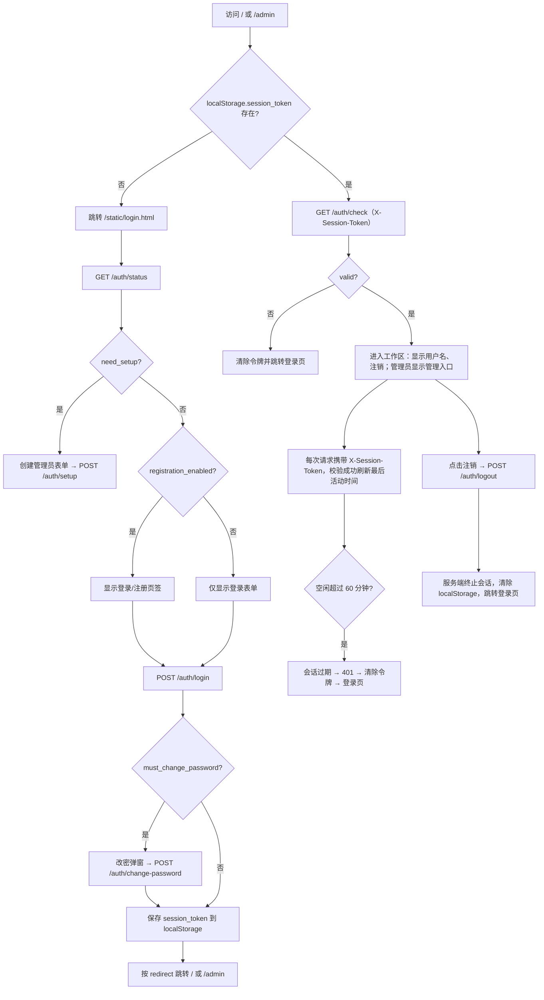

# Web 登录、语言切换与会话

浏览器访问 Web 工作区（`/`）或管理界面（`/admin`）时，前端会先检查浏览器里保存的会话令牌：没有令牌或令牌无效就跳转到登录页，有有效令牌则直接进入对应界面。本页说明登录页的首次设置、用户名密码登录、注册与强制改密，界面语言的选择方式，以及会话令牌的保存、刷新和失效行为。

账号与权限的完整管理见[账号、权限与 API 密钥](./accounts-permissions-and-api-keys.md)，Web 服务的启动与访问地址见[启动与访问](./launch-and-access.md)。本页只描述用户界面操作和会话机理，不展开 HTTP 接口契约；接口细节见开发者 HTTP API 的[鉴权与错误](../developer/http-api/authentication-and-errors.md)。

## 功能边界

- 登录页承担四种入口：首次创建管理员、用户名密码登录、注册（管理员开启时）、首次登录强制改密。
- 语言切换覆盖主工作区和管理界面；登录页本身没有语言选择器，界面文案固定为简体中文。
- 会话保持基于账号会话：令牌保存在浏览器 `localStorage`，每个请求通过 `X-Session-Token` 请求头发送，空闲 60 分钟过期。
- 界面里还残留一个与账号无关的旧版“访问密码”门（`/user/login`），它和 `/auth/*` 账号会话是两套机制，本文会区分说明。
- 用户操作与开发者 HTTP 路由分离：本文只描述页面上可见的行为，不把接口路径当作教程步骤。

## 登录页 {#login-page}

登录页是静态文件 `static/login.html`，通过 `/static/login.html` 访问。页面加载时并行做两件事：调用 `GET /auth/status` 决定显示哪个表单，调用 `GET /auth/check`（带已有令牌）判断是否可以直接跳过登录。

### 首次访问：创建管理员账户 {#first-run-setup}

`GET /auth/status` 在系统还没有任何用户时返回 `need_setup: true`。登录页隐藏“登录/注册”页签，显示“首次使用，请创建管理员账户”提示和创建表单：

| UI 调用 key | English 实际值 | 简体中文实际值 |
| --- | --- | --- |
| 硬编码（无 key） | —（登录页无英文文案） | 首次使用，请创建管理员账户 |
| 硬编码（无 key） | — | 管理员用户名 |
| 硬编码（无 key） | — | 管理员密码 |
| 硬编码（无 key） | — | 确认密码 |
| 硬编码（无 key） | — | 创建管理员账户 |

1. 输入管理员用户名（至少 2 个字符）和密码（至少 6 个字符），再次输入确认密码。
2. 点击“创建管理员账户”。前端调用 `POST /auth/setup` 提交 `{username, password}`。
3. 成功后服务端创建 `role=admin`、`group=admin` 的账户并立即创建会话；返回的令牌写入 `localStorage.session_token`，用户信息写入 `localStorage.user_info`，随后按安全规则跳转。

源码中还保留了一个“创建默认管理员”（`admin`/`admin123`）的方法和日志提示，但当前初始化流程不会自动调用它，而是提示访问登录页创建第一个管理员；这条路径是否会在某些发行版本启用，属于运行验证项。

### 用户名密码登录 {#username-password-login}

登录表单提交到 `POST /auth/login`，请求体为 `{username, password}`。

1. 用户名、密码都为空时前端直接提示“请输入用户名和密码”。
2. 凭据错误、用户不存在或账号被禁用时返回 `success: false`，页面显示对应错误。
3. 成功后返回会话令牌和用户信息。若 `must_change_password` 为真，先弹出“需要修改密码”弹窗；否则直接把令牌写入 `localStorage.session_token` 并跳转。
4. 跳转目标由 `getSafeRedirectUrl()` 决定：只有 URL 携带 `?redirect=/admin` 时返回 `/admin`，其余情况一律返回 `/`，避免开放重定向。

登录失败会按 IP 和用户名记录限流计数：同一个 IP 在 10 分钟内最多 15 次、同一个用户名最多 8 次，超限返回 `429` 并附带 `Retry-After`。

### 用户注册 {#user-registration}

注册页签是否显示取决于 `GET /auth/status` 的 `registration_enabled`，它来自管理员配置 `registration.enabled`（默认关闭）。

- 关闭时登录页只显示登录表单，直接调用 `POST /auth/register` 会返回 `403`（“注册功能未开启，请联系管理员”）。
- 开启时显示“登录/注册”两个页签。注册要求用户名至少 2 个字符、密码至少 6 个字符，确认密码必须一致。
- 成功后在管理员配置的 `default_group` 中创建普通用户（`role=user`），并立即创建会话、写入 `localStorage`。
- 注册按 IP 限流：10 分钟内最多 5 次，超限返回 `429`。

### 强制修改密码 {#force-change-password}

当登录返回 `must_change_password: true` 时，页面弹出“⚠️ 需要修改密码”弹窗，说明“为了账号安全，首次登录需要修改默认密码”。此时令牌先保存在内存变量里，不写入 `localStorage`。

- 输入新密码和确认新密码（至少 6 位），点击“确认修改”调用 `POST /auth/change-password`，请求头携带 `X-Session-Token`，请求体为 `{old_password, new_password}`。
- 修改成功后服务端清除 `must_change_password` 标记，前端才把令牌写入 `localStorage` 并跳转。
- 点击“稍后修改”会跳过改密直接保存令牌进入系统；服务端是否在后续请求中再次强制改密，属于运行验证项。

### 安全返回与旧密码门 {#safe-return-and-legacy-gate}

登录、注册和设置成功后的跳转只接受 `?redirect=/admin`，不会跟随任意 URL。管理界面在会话失效时会跳回 `/static/login.html?redirect=/admin`，因此登录成功后能直接回到管理面板。

此外，主工作区还保留了旧版“访问密码”逻辑：前端先请求 `/user/access`，若管理员配置 `user_access.require_password` 为真且 `sessionStorage` 中没有 `user_logged_in` 标记，就弹出“请输入访问密码”覆盖层；输入密码提交到 `POST /user/login`（表单字段 `password`），成功后仅在 `sessionStorage` 写入标记。这是单密码门，与账号、角色和会话令牌无关；同一 IP 在 10 分钟内最多尝试 10 次，超限返回 `429`。该逻辑是否仍被部署配置启用，需运行验证。

## 语言切换 {#language-switching}

### 主工作区语言选择器 {#workspace-language-selector}

主工作区 `index.html` 顶部有一个语言下拉框（`id="language-select"`），选项是硬编码的六种：

| 存储值 | English | 简体中文 |
| --- | --- | --- |
| `zh_CN` | Simplified Chinese | 简体中文 |
| `zh_TW` | Traditional Chinese | 繁體中文 |
| `en_US` | English | English |
| `ja_JP` | Japanese | 日本語 |
| `ko_KR` | Korean | 한국어 |
| `es_ES` | Spanish | Español |

切换语言的实际流程（`loadI18n` / `changeLanguage`）：

1. 优先读取 `localStorage.locale`；没有保存值时用浏览器语言 `navigator.language` 推断（`en`→`en_US`、`zh-CN`→`zh_CN`、`zh-TW`→`zh_TW`、`ja`→`ja_JP`、`ko`→`ko_KR`、`es`→`es_ES`，其余保持默认 `zh_CN`）。
2. 前端请求 `GET /i18n/{locale}`，服务端从 `desktop_qt_ui/locales/{locale}.json` 读取桌面版翻译文件（路径做了目录穿越防护）。
3. 加载失败时回退到 `GET /i18n/en_US`；`t(key, default)` 找不到 key 时返回默认文案或 key 本身。
4. 切换后调用 `applyTranslations()` 更新标题、按钮和页签，并重新生成配置表单以应用新语言。

语言选择只保存在当前浏览器的 `localStorage.locale`，不会写入服务器账号设置；换浏览器或清除站点数据后会回到浏览器推断值。

### 管理界面语言 {#admin-interface-language}

管理界面（`admin-new.html` + `js/admin/i18n.js`）使用独立的 `admin_locale` 键，默认值由浏览器语言推断，支持 `zh_CN`、`zh_TW`、`en_US`、`ja_JP`、`ko_KR` 五种（不含 `es_ES`），缺 key 时回退到 `zh_CN`。它的语言和主工作区互不影响。

### 登录页语言 {#login-page-language}

登录页不加载 i18n，也没有语言选择器，所有文案硬编码为简体中文。因此登录页显示语言与工作区选择无关。

### UI 文案对照 {#ui-copy-matrix}

以下 key 是 Web 前端实际通过 `t(key, default)` 调用的翻译项，值来自桌面 `en_US.json` / `zh_CN.json`：

| UI 调用 key | English 实际值 | 简体中文实际值 |
| --- | --- | --- |
| `Manga Translator` | Manga Translator | 漫画翻译器 |
| `admin` | 缺失（两语言均无此 key） | 缺失，恒回退为“管理” |
| `Add Files` | Add Files | 添加文件 |
| `Clear List` | Clear List | 清空列表 |
| `Translation Workflow Mode:` | Translation Workflow Mode: | 翻译流程模式： |
| `Start Translation` | Start Translation | 开始翻译 |
| `Export Config` | Export Config | 导出配置 |
| `Import Config` | Import Config | 导入配置 |
| `Basic Settings` | Basic Settings | 基础设置 |
| `Advanced Settings` | Advanced Settings | 高级设置 |
| `Options` | Options | 选项 |
| `API Keys (.env)` | API Keys (.env) | API密钥 (.env) |
| `env_hint` | API key input fields will appear below based on the selected translator | 根据选择的翻译器，下方会显示所需的 API 密钥输入框 |
| `Log output...` | Log output... | 日志输出... |
| `Normal Translation` | Normal Translation | 正常翻译流程 |
| `Export Translation` | Export Translation | 导出翻译 |
| `Export Original Text` | Export Original Text | 导出原文 |
| `Import Translation and Render` | Import Translation and Render | 导入翻译并渲染 |
| `Colorize Only` | Colorize Only | 仅上色 |
| `Upscale Only` | Upscale Only | 仅超分 |
| `Inpaint Only` | Inpaint Only | 仅修复 |

以下界面文案没有 i18n key，是 HTML 硬编码（登录页全部文案、工作区的“注销”按钮、管理员入口“管理”、语言下拉的六种语言名等）。桌面 locale 里还保留了一组 `web_language_selector`、`web_switch_language`、`web_current_language`、`web_confirm_language_switch`、`web_admin_panel`、`web_admin_only` 等 Web 相关 key，但当前 Web 静态代码没有引用它们，属于“目录中存在、尚未被引用”的待核对项。

## 会话保持 {#session-retention}

### 令牌生成与浏览器存储 {#token-generation-and-storage}

`SessionService.create_session` 用 `secrets.token_urlsafe(32)` 生成会话令牌，连同会话 ID、用户名、角色、IP、User-Agent、创建时间和最后活动时间保存在内存；服务开启 `enable_persistence` 时同步写入 `manga_translator/server/data/sessions.json`（只保存活动且未过期的会话）。

浏览器侧把令牌保存在 `localStorage.session_token`，用户信息保存在 `localStorage.user_info`。令牌不放在 Cookie 里，因此不会随 Cookie 自动发送；前端在每次请求中手动附加 `X-Session-Token` 请求头。

### 校验与活动刷新 {#validation-and-activity-refresh}

- 页面加载时：`checkAuthentication()` 先读 `localStorage.session_token`，没有就直接跳转登录页；有则请求 `GET /auth/check`，返回 `valid: false` 或请求失败就清除令牌并跳转登录页。
- 每次受保护请求：服务端 `require_auth` 依赖读取 `X-Session-Token`，缺失、无效或过期返回 `401`，账号被停用也返回 `401`；校验成功会调用 `update_activity` 刷新最后活动时间。
- 空闲超时：`session_timeout_minutes` 在 `main.py` 中固定为 `60`，即最后活动时间超过 60 分钟视为过期；后台每 5 分钟清理一次过期会话。
- 持久化重启：会话写入 `sessions.json` 后，服务重启时会重新加载活动且未过期的会话，浏览器令牌在服务重启后仍可能有效（运行验证项）。

### 注销与失效 {#logout-and-invalidation}

- 点击“注销”先调用 `POST /auth/logout`（带 `X-Session-Token`）让服务端终止该会话，再删除 `localStorage.session_token` 并跳转登录页。
- 会话被服务端终止或过期后，下一次请求会得到 `401`；前端清除令牌并跳回登录页，要求重新登录。
- 管理员停用账号后，该用户的现有会话会在下一次请求时被判定为无效（`401`，`USER_INACTIVE`）。

## 登录与会话流程 {#login-session-flow}

该图描述的是当前源码中的账号会话主流程；旧版 `/user/login` 单密码门、注册关闭、服务重启后的持久化会话等旁路不在图中展开，见上文对应小节。

## 错误与限流的用户含义 {#errors-and-rate-limits}

| 状态码 | 界面含义 | 触发情况（静态源码） | 用户可以做什么 |
| --- | --- | --- | --- |
| `401` | 未登录或会话失效 | 无令牌、令牌无效/过期、账号被停用 | 回到登录页重新登录；账号停用请联系管理员 |
| `403` | 无权限 | 非管理员访问管理功能；注册被管理员关闭 | 联系管理员开通权限，或等注册开放 |
| `429` | 尝试过于频繁 | 登录 15 次/IP/10 分钟、8 次/用户名/10 分钟；注册 5 次/IP/10 分钟；旧密码门 10 次/IP/10 分钟 | 等待响应头 `Retry-After` 指示的时间后再试 |

## 依赖与冲突

- Web 界面语言直接复用桌面版 `desktop_qt_ui/locales/*.json`，桌面新增或改名 key 会直接影响 Web 显示；`admin` 这样的缺失 key 会一直显示硬编码回退文案。
- 会话令牌存在 `localStorage`，同一浏览器不同标签页共享；旧密码门使用 `sessionStorage.user_logged_in`，只对单个标签页生效、关闭标签页即失效。
- 会话空闲超时 60 分钟与浏览器批量翻译请求的 30 分钟超时是两个独立参数：前者是服务端会话，后者是前端请求超时，不要混为一谈。
- `/auth/*` 账号会话与 `/sessions` 会话管理接口（`session_security_service`）是两套实现：用户登录走前者，管理端会话列表/访问日志走后者。
- 清除浏览器站点数据会同时删除 `session_token`、`locale`、`admin_locale`，效果等价于登出并恢复默认语言。
- 本页不保存也不展示任何真实令牌、用户名、密码或会话内容；文档只描述字段名和流程。

## 关联文件与格式

| 文件/格式 | 本页实际作用 | 手改与兼容注意 |
| --- | --- | --- |
| `manga_translator/server/static/login.html` | 登录页（首次设置/登录/注册/改密） | 全部硬编码中文，无 i18n key |
| `manga_translator/server/static/index.html` | 主工作区（语言下拉、注销、用户名、管理入口） | 语言选项硬编码，其余用 `t()` 翻译 |
| `manga_translator/server/static/script.js` | 会话检查、i18n 加载、语言切换、注销 | 令牌只存 `localStorage`，不要改成 Cookie 明文 |
| `manga_translator/server/static/js/i18n.js` | 登录页/工作区共享的 I18n 类 | 从 `/locales/{locale}.json` 加载桌面翻译 |
| `manga_translator/server/static/js/admin/i18n.js` | 管理界面 I18n（`admin_locale`） | 缺 key 回退 `zh_CN` |
| `manga_translator/server/core/session_service.py` | 会话创建、令牌、过期、持久化 | `session_timeout_minutes=60` 由 `main.py` 传入 |
| `manga_translator/server/core/account_service.py` | 账号、bcrypt 密码、`must_change_password` | 密码至少 6 位；不读取真实账号文件 |
| `manga_translator/server/core/middleware.py` | `require_auth` 校验 `X-Session-Token` | 无效/过期/停用统一 `401` |
| `manga_translator/server/routes/auth.py` | `/auth/status`、`/setup`、`/login`、`/register`、`/change-password`、`/check`、`/logout` | 登录/注册限流 |
| `manga_translator/server/routes/web.py` | `/`、`/admin` 静态页与旧 `/user/login` | 旧密码门独立于账号会话 |
| `manga_translator/server/data/accounts.json`、`sessions.json` | 账号与会话持久化 | 文档不展示真实内容 |
| `desktop_qt_ui/locales/*.json` | Web 语言翻译源（`/i18n/{locale}`） | 六种 locale；缺 key 回退 |

## Mermaid 数据流限制

上图画的是账号会话的主流程：首次设置、登录、强制改密、进入工作区、活动刷新、过期和注销。它不代表“每次访问都会请求 `/auth/status`”或“每个会话都会写盘”；`need_setup`、注册开关、旧密码门、服务重启后的持久化会话都会走对应旁路。图中没有伪造运行截图、真实令牌或私有任务产物；需要实际启动服务才能确认的显示细节都在验证记录中列为待运行。

## 源码依据 {#source-evidence}

| 层级 | 文件 | 本页核对内容 |
| --- | --- | --- |
| 登录页 UI | `manga_translator/server/static/login.html` | 首次设置/登录/注册/改密表单、`/auth/status` 分支、`getSafeRedirectUrl` |
| 工作区 UI | `manga_translator/server/static/index.html`、`script.js` | 会话检查、`X-Session-Token`、注销、`locale` 读写、语言回退 |
| 管理 UI | `manga_translator/server/static/admin-new.html`、`js/admin/app.js`、`js/admin/i18n.js` | `admin_locale`、`?redirect=/admin` 返回、会话检查 |
| 会话服务 | `manga_translator/server/core/session_service.py`、`system_init.py` | 令牌生成、60 分钟超时、每 5 分钟清理、持久化 |
| 账号服务 | `manga_translator/server/core/account_service.py` | 密码强度、bcrypt、`must_change_password`、默认管理员路径 |
| 鉴权中间件 | `manga_translator/server/core/middleware.py` | `require_auth`、401 语义、活动刷新 |
| 路由 | `manga_translator/server/routes/auth.py`、`web.py`、`config.py` | `/auth/*`、旧 `/user/login`、`/user/access`、`/i18n/{locale}` |
| i18n | `desktop_qt_ui/locales/en_US.json`、`zh_CN.json`、`doc/wiki/data/i18n.generated.json` | Web 实际调用 key 与三列实际值 |

## 验证记录 {#verification}

| 验证内容 | 状态 | 说明 |
| --- | --- | --- |
| BLUEPRINT、PAGE_GUIDELINES、TODO | 完成 | 已完整读取 1.3 节、5.12 小节与 9.3 节并按合同编写 |
| 登录/语言/会话 UI 与调用 | 完成 | 静态核对 `login.html`、`index.html`、`script.js`、管理端 JS |
| `en_US` / `zh_CN` 实际 locale | 完成 | 逐项核对 Web 调用 key；缺失 key 如实标记回退 |
| 会话运行链 | 完成 | 静态核对令牌生成、校验、活动刷新、过期清理与持久化 |
| 脱敏运行验证 | 待后续 | 未读取真实账号、令牌、`accounts.json`、`sessions.json` 或私有内容；首次设置、注册开关、旧密码门、强制改密与服务重启会话需启动 Web 服务验证 |
| VitePress | 待运行 | 由协调代理在合并前运行 `npm run docs:build --prefix doc/wiki` 及镜像/源码检查 |