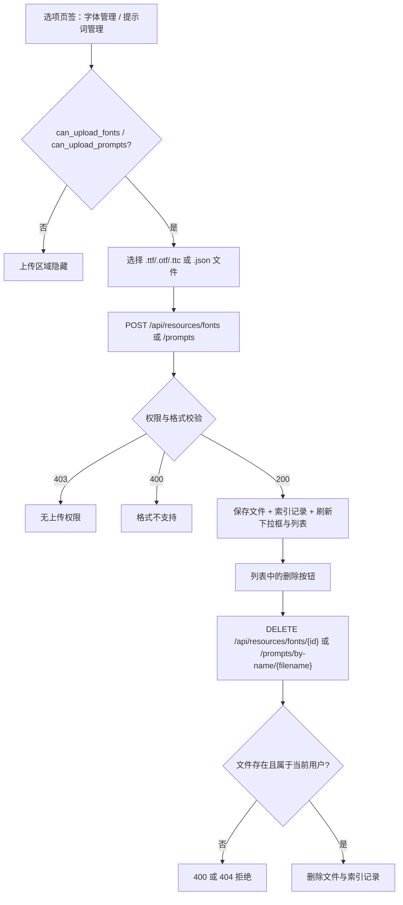
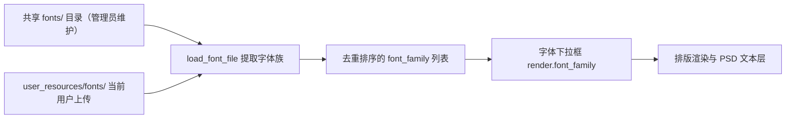
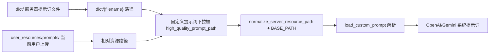

# 资源、字体与提示词

当服务器没有提供你需要的字体，或翻译器需要自定义提示词时，可以在 Web 工作区的“选项”页签上传自己的字体和提示词文件，并在配置下拉框中选择它们。本页只描述普通用户的资源上传、列表、删除和配置使用；管理员维护的共享字体与提示词见[管理员界面](./administrator-interface.md)，HTTP 端点契约见[配置、环境与资源 API](../developer/http-api/config-env-and-resources.md)。

## 功能边界 {#feature-boundary}

- 本页覆盖 Web 用户资源：字体（TTF/OTF/TTC）和提示词（JSON）的上传、列出、删除，以及 `render.font_family` 与 `translator.high_quality_prompt_path` 两个配置字段。
- 上传区域是否显示由 `/user/settings` 返回的 `can_upload_fonts`、`can_upload_prompts` 决定；删除是否允许由服务端权限检查决定。
- 不覆盖管理员维护的共享字体与提示词（`/upload/font`、`/upload/prompt`、`/fonts`、`/prompts` 管理端点），也不覆盖桌面端的提示词列表 CRUD（见[提示词列表、应用与预览](../desktop/prompts/list-apply-and-preview.md)）。
- 本页不展示任何真实 API Key、私有提示词正文或用户文件内容。

## UI 操作 {#ui-operations}

### 找到资源与配置入口 {#find-resource-entry}

登录后进入主工作区，右侧设置面板有“基本设置”（Basic Settings）、“高级设置”（Advanced Settings）、“选项”（Options）、“API密钥”（API Keys (.env)）四个页签。

- “字体管理”与“提示词管理”两个区域位于“选项”页签的右侧列。
- 只有 `can_upload_fonts` / `can_upload_prompts` 为真时对应上传区域才显示；区域隐藏不等于服务器禁止，权限最终由服务端校验。
- `render.font_family` 下拉框位于“高级设置”页签（render 分组），`translator.high_quality_prompt_path` 下拉框位于“基本设置”页签（translator 分组）；两者即使选项为空也会显示下拉框，并带“-- 不使用 --”空选项。

### 上传字体 {#upload-fonts}

1. 在“选项”页签的“字体管理”区域点击“上传字体文件”。
2. 文件选择框只允许 `.ttf`、`.otf`、`.ttc`；后端同样只接受这三种格式。
3. 上传成功后前端重新请求 `/config/options`，刷新“字体”下拉框和“已上传的字体”列表，并在日志输出“字体上传成功”。

### 上传提示词 {#upload-prompts}

1. 在“选项”页签的“提示词管理”区域点击“上传提示词文件”。
2. 文件选择框只允许 `.json`；服务端 `resource_service` 的 `PROMPT_FORMATS` 是 `.txt`/`.json`，但提示词加载器（`load_prompt_file`）只解析 `.json`/`.yaml`/`.yml`，因此请使用 JSON。
3. 上传成功后刷新“自定义提示词”下拉框和“已上传的提示词”列表。

### 删除资源 {#delete-resources}

- 字体行始终显示“删除”按钮；提示词行只有路径包含 `user_resources` 的用户资源才显示“删除”，服务器自带提示词显示“服务器提示词”标签。
- 点击“删除”会弹出确认框，确认后调用删除端点；前端随后刷新下拉框和列表。
- 前端不按 `can_delete_fonts` / `can_delete_prompts` 隐藏删除按钮，权限由服务端拒绝并返回 `403`。

### UI 文案对照 {#i18n-strings}

| UI 调用 key | English 实际值 | 简体中文实际值 |
| --- | --- | --- |
| `label_font_family` | Font | 字体 |
| `label_high_quality_prompt_path` | Custom Prompt | 自定义提示词 |
| `font_uploaded` | Font uploaded successfully | 字体上传成功 |
| `font_upload_failed` | Font upload failed | 字体上传失败 |
| `font_upload_error` | Font upload error | 字体上传错误 |
| `prompt_uploaded` | Prompt uploaded successfully | 提示词上传成功 |
| `prompt_upload_failed` | Prompt upload failed | 提示词上传失败 |
| `prompt_upload_error` | Prompt upload error | 提示词上传错误 |
| `web_upload_font` | Upload Font | 上传字体 |
| `web_upload_prompt` | Upload Prompt | 上传提示词 |
| `web_my_fonts` | My Fonts | 我的字体 |
| `web_my_prompts` | My Prompts | 我的提示词 |
| `web_resource_management` | Resource Management | 资源管理 |
| `web_can_upload_font` | Can Upload Font | 可上传字体 |
| `web_can_upload_prompt` | Can Upload Prompt | 可上传提示词 |

部分消息 key 在两个 locale 中缺失，`t()` 会回退到代码中的中文默认文案，英文界面也会显示中文：

| UI 调用 key | 两个 locale 状态 | 回退显示 |
| --- | --- | --- |
| `font_deleted` / `prompt_deleted` | 缺失 | 字体删除成功 / 提示词删除成功 |
| `font_delete_failed` / `prompt_delete_failed` | 缺失 | 字体删除失败 / 提示词删除失败 |
| `font_delete_error` / `prompt_delete_error` | 缺失 | 字体删除错误 / 提示词删除错误 |

“字体管理”“上传字体文件”“支持 TTF, OTF, TTC 格式”“已上传的字体”“加载中...”“暂无已上传的字体”“提示词管理”“上传提示词文件”“支持 JSON 格式”“已上传的提示词”“暂无已上传的提示词”“服务器提示词”“-- 不使用 --”“删除”等为 `index.html` 或 `script.js` 中硬编码的中文文案，不经过 `t()`，切换语言不会翻译。

## 参数与选项 {#parameters-and-options}

#### `render.font_family` — 字体 / Font {#font-family}

- 控件：下拉框（始终显示，含“-- 不使用 --”空选项）。
- 所在界面：设置面板 → “高级设置”（render 分组）；UI 调用 key 为 `label_font_family`。
- 存储值：字体族名称字符串；空值表示使用渲染器的默认字体。
- 可选值：`/config/options` 的 `font_family` 列表，来自共享 `fonts/` 目录字体族与当前用户上传字体族的去重并集。
- 默认值：核心 `manga_translator/config.py#RenderSettings.font_family` 为 `None`；Web 发行配置 `server_config.json` 为 `Microsoft YaHei UI`。
- 生效阶段：排版渲染与可编辑 PSD 文本层。
- 原理：下拉框聚焦时重新请求 `/config/options` 以刷新刚上传的字体；选项显示简短文件名（有路径时取最后一段）。选中值随翻译请求以 `render.font_family` 提交，渲染端按字体族在 Qt 字体库中匹配。
- 依赖与冲突：字体文件必须能被 `load_font_file` 提取出有效家族名；`.ttc` 集合字体可能返回多个家族。找不到请求家族时渲染端回退到默认家族并记录警告。
- 关联文件和调试产物：`fonts/`（共享）、`manga_translator/server/data/user_resources/fonts/{username}/`（用户）。
- 图示：需要字体族合并与消费数据流，见[字体下拉列表如何合并](#font-merge)。
- 源码依据：定义/默认 `manga_translator/config.py`、`server/server_config.json`；选项构建 `routes/config.py#get_config_options`；UI `static/script.js#generateConfigUI`、`updateFontSelects`；消费 `request_extraction.py`、`rendering/text_render/_fonts.py`。
- 验证状态：源码/i18n 静态核对完成；脱敏运行验证待后续 Web 验收。

#### `translator.high_quality_prompt_path` — 自定义提示词 / Custom Prompt {#high-quality-prompt-path}

- 控件：下拉框（始终显示，含“-- 不使用 --”空选项）。
- 所在界面：设置面板 → “基本设置”（translator 分组）；UI 调用 key 为 `label_high_quality_prompt_path`。
- 存储值：相对路径字符串；空值表示不加载自定义提示词。
- 可选值：`/config/options` 的 `high_quality_prompt_path` 列表 = `dict/` 下排除系统 stem 的提示词（`dict/{filename}`）+ 用户上传提示词的相对资源路径（`manga_translator/server/data/user_resources/prompts/{username}/{filename}`）。
- 默认值：核心 `manga_translator/config.py#TranslatorSettings.high_quality_prompt_path` 为 `None`；Web 发行配置 `server_config.json` 为 `dict/prompt_example.yaml`。
- 生效阶段：翻译请求的系统提示词构建（OpenAI/Gemini HQ 翻译器）。
- 原理：选中路径经 `normalize_server_resource_path` 规范化后与 `BASE_PATH` 拼接，`load_custom_prompt` 解析为字典并放入 `Context.custom_prompt_json`，再由 OpenAI/Gemini 系统提示词构建器展平使用。解析失败只记录警告，不会把无效内容发给模型。
- 依赖与冲突：只有支持自定义提示词的翻译器消费它；`.txt` 能通过上传校验但无法被加载器解析。提示词内容属于私有文本，不得在日志、导出或共享调试产物中公开。
- 关联文件和调试产物：`dict/`、`user_resources/prompts/`；不保存请求正文。
- 图示：需要提示词合并与消费数据流，见[提示词下拉列表如何合并](#prompt-merge)。
- 源码依据：定义/默认 `manga_translator/config.py`、`server/server_config.json`；选项构建 `routes/config.py#get_config_options`；加载 `manga_translator.py#_load_and_prepare_prompts`、`translators/prompt_loader.py`；消费 `translators/openai.py`、`gemini.py`。
- 验证状态：源码/i18n 静态核对完成；脱敏运行验证待后续 Web 验收。

## 运行机理 {#runtime-behavior}

### 资源存储与索引 {#resource-storage}

用户资源按用户隔离存储：

| 资源 | 目录 | 索引 |
| --- | --- | --- |
| 字体 | `manga_translator/server/data/user_resources/fonts/{username}/` | `user_resources/fonts/index.json` |
| 提示词 | `manga_translator/server/data/user_resources/prompts/{username}/` | `user_resources/prompts/index.json` |

上传时先做文件名清洗（去掉路径段以及 `..`、`/`、`\`、NUL），重名时追加数字后缀；索引记录 `id`、`user_id`、`filename`、`file_path`、`file_size`、`file_format`（字体另记录 `font_family`）。删除同时移除文件与索引记录。

### 资源生命周期 {#resource-lifecycle}

限制说明：上传与删除都要求会话，并分别检查资源权限；即使界面显示了按钮，无权限的请求也会被服务端以 `403` 拒绝。

### 字体下拉列表如何合并 {#font-merge}

说明：`/config/options` 只返回字体族名称，不返回文件路径；`load_font_file` 会把字体注册进 Qt 字体库并返回家族名，因此刚上传的字体需要重新请求选项后才能出现在下拉框中。

### 提示词下拉列表如何合并 {#prompt-merge}

说明：`dict/` 扫描会排除 `system_prompt_hq`、`system_prompt_hq_format`、`system_prompt_line_break`、`glossary_extraction_prompt` 四个系统 stem；用户提示词路径来自 `get_user_prompts`，与服务器提示词拼接后按服务器提示词在前、用户提示词在后的顺序出现。

## 依赖与冲突 {#dependencies-and-conflicts}

- 上传字体后必须先重新加载配置选项（聚焦下拉框或重新登录）才能在选择器中看到；字体未注册时渲染端会回退到默认家族。
- 提示词必须是可解析的 JSON；`.txt` 可上传但无法被加载，翻译时按缺失处理。
- 管理员共享字体/提示词与用户私有资源是两套存储与权限：共享资源见[管理员界面](./administrator-interface.md)，两套资源的 HTTP 契约见[配置、环境与资源 API](../developer/http-api/config-env-and-resources.md)。
- 资源权限由用户组配置（`can_upload_fonts`、`can_upload_prompts`、`can_delete_fonts`、`can_delete_prompts`）决定；前端隐藏只影响显示，不能绕过服务端检查。
- 上传的文件名会被清洗、重名会加数字后缀；不要依赖上传后的原始文件名。

## 关联文件与格式 {#related-files-and-formats}

| 文件/格式 | 本页实际作用 | 手改与兼容注意 |
| --- | --- | --- |
| `.ttf` / `.otf` / `.ttc` | 用户字体上传格式 | 仅这三种扩展名；字体族由 `load_font_file` 提取 |
| `.json` | 用户提示词上传格式（UI 限制） | 根结构必须是对象；`load_prompt_file` 只解析 JSON/YAML |
| `.txt` | 服务端提示词格式白名单包含但无法消费 | 不要上传，翻译时按缺失处理 |
| `manga_translator/server/data/user_resources/fonts/` | 用户字体存储 | 按用户名分子目录；不展示真实用户文件 |
| `manga_translator/server/data/user_resources/prompts/` | 用户提示词存储 | 路径出现在下拉框选项中，公开报告需脱敏 |
| `fonts/` | 共享字体目录（管理员维护） | 只有管理员可写；普通用户下拉框可见 |
| `dict/` | 服务器提示词目录（管理员维护） | 系统 stem 被排除；普通用户下拉框可见 |
| `server_config.json` | Web 发行默认 `font_family` 与 `high_quality_prompt_path` | 只引用脱敏默认值 |

## 源码依据 {#source-evidence}

| 层级 | 文件 | 本页核对内容 |
| --- | --- | --- |
| UI | `manga_translator/server/static/index.html`、`static/script.js` | 资源区域、上传/删除处理、下拉框刷新 |
| i18n | `manga_translator/server/static/js/i18n.js`、`desktop_qt_ui/locales/en_US.json`、`zh_CN.json` | key 映射、实际中英文与缺失回退 |
| 服务 | `manga_translator/server/core/resource_service.py` | 格式白名单、文件名清洗、重名后缀、索引记录 |
| 路由 | `manga_translator/server/routes/resources.py` | `/api/resources/*` 上传/列表/删除/统计与权限 |
| 选项构建 | `manga_translator/server/routes/config.py` | `font_family`、`high_quality_prompt_path` 合并逻辑 |
| 配置模型 | `manga_translator/config.py`、`server/server_config.json` | 核心与 Web 发行默认值 |
| 消费 | `manga_translator/manga_translator.py`、`translators/prompt_loader.py`、`rendering/text_render/_fonts.py` | 路径规范化、提示词解析、字体族注册 |

## 验证记录 {#verification}

| 验证内容 | 状态 | 说明 |
| --- | --- | --- |
| BLUEPRINT、PAGE_GUIDELINES、TODO | 完成 | 已完整读取并按页面合同编写 |
| UI 布局与调用 | 完成 | 静态核对 `index.html`、`script.js` 资源区与下拉框 |
| i18n 实际 locale | 完成 | 记录 key、en/zh 实际值及缺失回退 |
| 资源存储与合并流程 | 完成 | 静态核对 `resource_service.py`、`routes/config.py` 与消费链 |
| 脱敏运行验证 | 待后续 | 未启动 Web 服务、未读取真实 `.env`/用户文件/私有提示词 |
| VitePress | 待运行 | 由协调代理在合并前运行镜像/源码检查与 `docs:build` |
