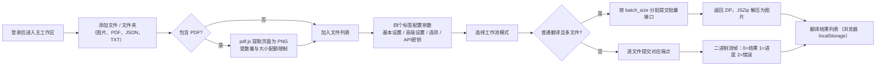

# Web 上传、配置与翻译

登录 Web 界面（`/`）后，主工作区用于完成"上传图片 → 配置参数 → 发起翻译"的完整流程：左侧面板添加文件、选择工作流模式并开始任务，右侧四个标签配置参数与 API 密钥。本页只描述用户界面操作；浏览器实际调用的 HTTP 端点的请求、响应、鉴权与状态码契约见开发者文档 `../developer/http-api/translation-endpoints.md` 与 `../developer/http-api/streaming-protocol.md`。

## 功能边界

- 本页覆盖 Web 用户界面中的上传、配置与发起翻译。登录与会话见[登录、语言与会话](./login-language-and-session.md)，进度、结果与历史见[进度、结果与历史](./progress-results-and-history.md)，账号、权限与 API 密钥见[账号、权限与 API 密钥](./accounts-permissions-and-api-keys.md)，字体与提示词上传见[资源、字体与提示词](./resources-fonts-and-prompts.md)，访问地址见[启动与访问](./launch-and-access.md)。
- Web 前端不是桌面 Qt 界面的直接复用：`index.html` 自带初始中文，`script.js` 通过 i18n key 覆盖一部分静态文字；"添加文件夹"、"文件列表"、"翻译结果"、"翻译历史"、"N 个文件"等仍是 HTML/脚本硬编码，没有对应 i18n key。
- 上传、PDF 提取、配置导入导出和结果列表都在浏览器本地完成；浏览器 `localStorage` 中的结果列表与服务器翻译历史是两套独立存储。
- 工作流模式下拉框控制的 `cli.load_text`、`cli.translate_json_only`、`cli.template`、`cli.generate_and_export`、`cli.colorize_only`、`cli.upscale_only`、`cli.inpaint_only`，以及 `cli.batch_size`、`cli.batch_concurrent`、`cli.use_gpu` 等键被服务器端 `SERVER_HIDDEN_CONFIG_KEYS` 隐藏，不显示在 Web 配置表单中；不要手工编辑这些键。
- 上传数量/大小限制、API 密钥编辑开关、字体与提示词上传权限来自 `/user/settings`；`0` 表示不限制。

## UI 操作

### 添加文件与文件夹

1. 左侧"文件列表"面板提供三个按钮："添加文件"（`Add Files`）、"添加文件夹"（HTML 硬编码中文，未走 i18n）、"清空"（`Clear List`）。
2. 点击"添加文件"打开系统多选对话框；点击"添加文件夹"选择整个目录。文件选择器的 `accept` 为 `image/*,.pdf,.json,.txt`。
3. 选择 PDF 时，浏览器用 pdf.js 按 2x 渲染每一页并提取为 PNG（文件名形如 `{原名}_page_{页码}.png`）。提取受 `max_pdf_size_mb`（前端兜底 50MB）与 `max_images_per_batch` 限制；超过配额只提取剩余页并写警告日志。PDF 相关日志文案是脚本内硬编码中文 fallback（`en_US`、`zh_CN` 两个 locale 均无这些 key）。
4. 同时选中的 `.json`、`_original.txt`、`_translated.txt` 会被按基础文件名与图片匹配，供"导入译文并渲染"模式使用；匹配成功或失败都会写入日志。
5. 列表项右侧 `✖` 移除单项；"清空"清空全部；文件计数显示 `N 个文件`（硬编码中文）。
6. 超过数量或大小限制时，前端弹出 `alert` 并拒绝本次添加。

### 配置参数

1. 右侧设置区有四个标签："基本设置"（`Basic Settings`）、"高级设置"（`Advanced Settings`）、"选项"（`Options`）、"API密钥"（`API Keys (.env)`）。标签切换只在本地显示，不触发网络请求。
2. 配置表单由 `GET /config?mode=authenticated` 返回的数据生成；下拉选项来自 `/config/options`、`/translators`、`/languages`、`/workflows`。标签优先使用 `label_<key>` 翻译键，其次 `t(key)`，最后显示格式化键名。
3. 服务器按用户权限过滤：无权限的参数整组隐藏（`allowed_parameters`）；工作流下拉只保留 `allowed_workflows`；"API密钥"标签由 `show_env_editor` 与登录状态共同决定；字体/提示词上传区由 `can_upload_fonts`/`can_upload_prompts` 决定。
4. 布尔参数显示为"是/否"下拉（`True`/`False`），数字为数字框，字符串/枚举为文本框或下拉框。
5. "导出配置"（`Export Config`）把当前表单值序列化为 `config.json` 下载；"导入配置"（`Import Config`）读取本地 JSON 并重新生成表单。导入导出都在浏览器本地完成，不经过服务器。
6. 需要 API 密钥时切换到"API密钥"标签：编辑器按翻译、OCR、上色、渲染四个分组渲染密钥输入框（password 或 text 类型），"保存 API 密钥"按钮把已填写的 key POST 到 `/env`，并暂存到 `localStorage.user_env_vars`。`/env` 与 `/env/effective` 不返回服务器密钥明文；本文档不收录任何真实密钥。

### 选择工作流模式

"翻译流程模式"（`Translation Workflow Mode:`）下拉框列出七种模式，可用选项由 `/workflows` 按权限返回。下表同时给出各模式在前端脚本中对应的提交端点（机制说明；完整请求/响应契约见开发者 HTTP API 页面）：

| 下拉值 | 模式（i18n） | 前端提交端点（机制说明） |
| --- | --- | --- |
| `normal` | Normal Translation / 正常翻译流程 | 多文件：`/translate/batch/images`；单文件：`/translate/with-form/image/stream` |
| `export_trans` | Export Translation / 导出翻译 | `/translate/export/translated` |
| `export_raw` | Export Original Text / 导出原文 | `/translate/export/original` |
| `import_trans` | Import Translation and Render / 导入译文并渲染 | `/translate/import/json`（需图片与同名 JSON） |
| `colorize` | Colorize Only / 仅上色 | `/translate/colorize` |
| `upscale` | Upscale Only / 仅超分 | `/translate/upscale` |
| `inpaint` | Inpaint Only / 仅修复 | `/translate/inpaint` |

### 发起翻译

1. 确认文件列表与参数后点击"开始翻译"（`Start Translation`）。文件列表为空时，日志提示先添加图片文件。
2. 普通翻译且文件数大于 1：按 `cli.batch_size`（前端读取缺失时兜底为 `5`）把文件分批，每批把图片转成 data URI 提交批量接口，请求带 30 分钟浏览器超时（`AbortController`）；响应为 ZIP，浏览器用 JSZip 解压并把图片逐张加入"翻译结果"列表；JSZip 不可用或解压失败时直接下载 ZIP。
3. 普通翻译单文件或非普通模式：逐文件提交。普通模式走二进制流接口，浏览器解析自定义帧（1 字节状态 + 4 字节长度 + 数据；`0`=结果数据、`1`=进度 JSON、`2`=错误）；进度消息写入"日志输出"，错误会中断当前文件。
4. API 密钥：单文件请求把当前输入的密钥作为 `user_env_vars` 表单字段一并提交；批量请求使用服务器端为该用户保存的密钥。`runtime_api.py` 把这些值映射到各 feature/provider 的运行时覆盖。
5. 任务日志：翻译过程中每 500ms 轮询新日志（`/api/logs?limit=200&task_id=...`），任务结束后按 `task_id` 拉取完整日志；轮询返回 `401` 时停止轮询并提示重新登录。
6. 完成后的图片出现在"翻译结果"列表，可查看大图、单项下载、打包下载或清空；该列表保存在浏览器 `localStorage`，与服务器历史记录无关。

### UI 文案对照

Web 页面的可翻译文案先查 `script.js` 的调用 key，再核对 `desktop_qt_ui/locales/en_US.json` 与 `zh_CN.json`。下表为与"上传、配置、翻译"直接相关的 key；缺失项如实标记，不擅自补译。

| UI 调用 key | English 实际值 | 简体中文 实际值 |
| --- | --- | --- |
| `Manga Translator` | Manga Translator | 漫画翻译器 |
| `Add Files` | Add Files | 添加文件 |
| `Clear List` | Clear List | 清空列表 |
| `Translation Workflow Mode:` | Translation Workflow Mode: | 翻译流程模式： |
| `Start Translation` | Start Translation | 开始翻译 |
| `Export Config` | Export Config | 导出配置 |
| `Import Config` | Import Config | 导入配置 |
| `Basic Settings` | Basic Settings | 基础设置 |
| `Advanced Settings` | Advanced Settings | 高级设置 |
| `Options` | Options | 选项 |
| `API Keys (.env)` | API Keys (.env) | API密钥 (.env) |
| `Log output...` | Log output... | 日志输出... |
| `Normal Translation` | Normal Translation | 正常翻译流程 |
| `Export Translation` | Export Translation | 导出翻译 |
| `Export Original Text` | Export Original Text | 导出原文 |
| `Import Translation and Render` | Import Translation and Render | 导入译文并渲染 |
| `Colorize Only` | Colorize Only | 仅上色 |
| `Upscale Only` | Upscale Only | 仅超分 |
| `Inpaint Only` | Inpaint Only | 仅修复 |
| `admin` | 缺失（两个 locale 均无此 key） | 缺失，调用处 fallback 为"管理" |
| `env_hint` | API key input fields will appear below based on the selected translator | 根据选择的翻译器，下方会显示所需的 API 密钥输入框 |
| `view` | View | 查看 |
| `download` | Download | 下载 |
| `delete` | Delete | 删除 |
| `import_mode_no_json` | Import mode: JSON file not found | 导入翻译模式：未找到JSON文件 |
| `import_mode_json_only` | Import mode: Only JSON files are supported, TXT files are not supported | 导入翻译模式：只支持JSON文件，不支持TXT文件 |
| `using_translation_file` | Using translation file | 使用翻译文件 |
| `extracting_pdf` | 缺失（两个 locale 均无此 key） | 缺失，调用处 fallback 为"正在提取PDF页面" |
| `folder_scan_result` | Found in folder | 从文件夹中找到 |
| `translation_file_matched` | Translation file matched | 翻译文件已匹配 |
| `translation_file_no_match` | No matching image found | 未找到匹配的图片 |
| `packing_results` | Packing all results... | 正在打包所有结果... |
| `download_complete` | Download complete | 下载完成 |
| `confirm_clear_results` | Are you sure you want to clear all translation results? | 确定要清空所有翻译结果吗？ |
| `results_cleared` | Translation results cleared | 翻译结果已清空 |

"添加文件夹"、"文件列表"、"翻译结果"、"翻译历史"、"N 个文件"、"日志输出"面板标题初始 HTML 等为硬编码，没有对应 i18n key（其中"日志输出"面板标题由 `Log output...` key 覆盖）。

## 参数与选项

#### `cli.batch_size` — 批量大小 / Batch Size {#cli-batch-size}

- 控件：无。Web 配置表单不渲染该参数，服务器端 `SERVER_HIDDEN_CONFIG_KEYS` 直接隐藏；前端脚本读取 `config.cli.batch_size` 决定分批。
- 所在界面：不显示；仅前端 `startTask`/`processBatch` 读取。
- 存储值：非负整数；Web 前端读取缺失时兜底为 `5`。
- 可选值：整数；无枚举下拉。
- 默认值：核心代码 `manga_translator/config.py#CliConfig.batch_size = 1`；发行配置 `config/config-example.json = 3`；Web 前端 `script.js` 兜底 `5`；后端批量请求模型 `BatchTranslateRequest.batch_size = 4`（前端总会显式传值，实际生效的是前端值）。三类默认不应合并写成单一默认。
- 生效阶段：普通翻译且文件数大于 1 时的分批调度；每批大小取 `min(batch_size, 剩余文件数)`。
- 原理：`startTask` 按该值把文件列表切成批次，逐批调用批量翻译接口，请求体携带 `batch_size`。
- 依赖与冲突：只影响"普通翻译"多文件路径；导出、导入、上色、超分、修复模式逐文件处理，不使用该值。
- 关联文件和调试产物：不产生独立文件；只影响请求分批与后端 `get_batch_ctx` 的批处理。
- 图示：不需要：只决定分批数量，不改变处理阶段顺序或算法分支。
- 源码依据：`static/script.js`（`startTask`、`processBatch`）；`server/routes/config.py`（隐藏键）；`server/request_extraction.py#BatchTranslateRequest`。
- 验证状态：进行中（静态核对完成，未运行脱敏批量验证）。

#### `translator.translator` — 翻译器 / Translator {#translator}

- 控件：下拉框；选项由 `/translators` 返回并按权限过滤，显示名用 `translator_<value>` key 翻译。
- 所在界面：设置区 → "基本设置"。
- 存储值：翻译器标识，如 `openai`、`gemini`、`sakura`、`none`、`original` 等。
- 可选值：由服务器 `/translators` 决定，无固定前端枚举。
- 默认值：核心代码 `manga_translator/config.py#TranslatorConfig.translator = Translator.openai_hq`；发行配置 `config/config-example.json = "openai"`。
- 生效阶段：翻译请求构建（`translator_gen` 按 `translator:target_lang` 构造翻译器）。
- 原理：下拉框写入 `translator.translator`；`runtime_api.py` 的 `RUNTIME_API_ENV_PRIORITY` 决定各 provider 的 API 地址/模型覆盖来源。
- 依赖与冲突：只决定翻译实现；OCR、上色、渲染的模型与密钥分组互相独立。
- 关联文件和调试产物：不产生独立文件；影响翻译请求与日志中的翻译器名。
- 图示：不需要：选项只改变最终消费者实现，本页已用表格列出模式端点。
- 源码依据：`static/script.js`（`loadTranslators`、`replaceWithSelectTranslated`）；`server/routes/config.py#get_translators`；`manga_translator/config.py#TranslatorConfig`。
- 验证状态：进行中（静态核对完成）。

#### `translator.target_lang` — 目标语言 / Target Language {#target-lang}

- 控件：下拉框；选项由 `/languages` 返回，显示名用 `lang_<code>` key 翻译。
- 所在界面：设置区 → "基本设置"。
- 存储值：目标语言代码，如 `CHS`、`ENG`。
- 可选值：由服务器 `/languages` 决定。
- 默认值：核心代码 `manga_translator/config.py#TranslatorConfig.target_lang = "ENG"`；发行配置 `config/config-example.json = "CHS"`。
- 生效阶段：翻译请求构建（`translator_gen` 把 `target_lang` 传给翻译器）。
- 原理：下拉框写入 `translator.target_lang`；与保留源语言（`keep_lang`）是两个独立选项。
- 依赖与冲突：翻译器必须支持所选目标语言；`translator_chain` 可逐段覆盖目标语言。
- 关联文件和调试产物：不产生独立文件。
- 图示：不需要：单一枚举选择，无分支图。
- 源码依据：`static/script.js`（`loadLanguages`）；`server/routes/config.py#get_languages`；`manga_translator/config.py#TranslatorConfig`。
- 验证状态：进行中（静态核对完成）。

#### `translator.keep_lang` — 保留源语言 / Keep Source Language {#keep-lang}

- 控件：下拉框；选项来自 `/config/options` 的 `keep_lang`，`none` 显示为"不过滤"（`lang_filter_disabled`）。
- 所在界面：设置区 → "基本设置"。
- 存储值：保留源语言代码或 `none`；`none` 表示不按源语言过滤。
- 可选值：`none` 及服务器返回的语言列表。
- 默认值：核心代码 `manga_translator/config.py#TranslatorConfig.keep_lang = "none"`；发行配置 `config/config-example.json = "none"`。
- 生效阶段：翻译前的合并过滤阶段。
- 原理：开启后，`manga_translator.py` 按区域检测语言过滤：检测语言与 `keep_lang` 不匹配的区域被移除（不翻译），并写入"合并后保留语言过滤"日志；`CHS`/`CHT` 与共享 CJK 判定有专门处理。
- 依赖与冲突：依赖检测阶段输出的语言；与目标语言无关。
- 关联文件和调试产物：不产生独立文件；过滤数量出现在任务日志中。
- 图示：不需要：单一枚举选择。
- 源码依据：`static/script.js`（`populateDropdowns`）；`server/routes/config.py#_get_server_keep_lang_options`；`manga_translator/manga_translator.py`（`_keep_language_matches`、合并过滤）。
- 验证状态：进行中（静态核对完成）。

## 上传与翻译数据流

"普通翻译且多文件"走批量接口（返回 ZIP），其余模式逐文件提交。进度帧只出现在单文件普通翻译的二进制流中；批量接口在请求完成或取消后统一返回结果。

## 依赖与冲突

- 上传限制（数量、单图大小、PDF 大小）来自 `/user/settings`，由管理员/用户组配额决定；`0` 表示不限制，前端在超出时拒绝添加。
- 配置表单内容由权限过滤：用户组可隐藏参数、设置默认值；用户白名单可以解锁被用户组禁用的参数；被过滤的参数不会显示，也不应手工注入。
- `cli.batch_size` 只控制普通翻译多文件的分批；它与 `context_size`、`batch_concurrent` 是不同层级，不能相互替代。
- "导入译文并渲染"需要图片与同名 JSON 同时上传；只上传图片会在日志中提示缺少 JSON，并跳过该文件。
- 批量接口与单文件接口的 API 密钥来源不同：单文件把当前输入的密钥随请求发送；批量接口使用服务器端保存的密钥。切换语言、刷新页面不会丢失已保存到 `/env` 的密钥，但会清空未保存的临时输入。
- 浏览器结果列表（`localStorage`）与服务器翻译历史是两套存储；清空结果列表不影响服务器历史。
- 上传与翻译涉及业务内容。共享日志、导出文件或调试目录前必须删除请求正文、历史页文本、路径与凭据。

## 关联文件与格式

| 文件/格式 | 本页实际作用 | 手改与兼容注意 |
| --- | --- | --- |
| `image/*`（PNG、JPG、WebP 等） | 主要输入：普通翻译、导出、导入渲染、上色、超分、修复 | 由后端图片格式支持列表决定；文档不收录用户图片 |
| `.pdf` | 浏览器端 pdf.js 提取为 PNG 页 | 受 `max_pdf_size_mb`/`max_images_per_batch` 限制；提取日志为硬编码 fallback |
| `.json` | "导入译文并渲染"所需的翻译文件；配置导入/导出的格式 | JSON 需可解析；与图片按基础文件名匹配 |
| `_original.txt` / `_translated.txt` | 与图片同名匹配，供导入翻译模式使用 | 仅在浏览器端匹配；后端导入端点接收 JSON |
| `config.json` | "导出配置"下载 / "导入配置"读取的格式 | 导入在浏览器本地重新生成表单；隐藏键不会被导入显示 |
| `localStorage`（`session_token`、`locale`、`translationResults`、`user_env_vars`） | 会话令牌、语言、结果列表、临时密钥 | 浏览器本地存储；结果列表不等于服务器历史 |
| `manga_translator/server/static/` | Web 前端静态资源（`index.html`、`script.js`、`js/i18n.js`、`js/shared/api-key-schema.js`） | 前端硬编码中文与 i18n 覆盖并存 |

## Mermaid 数据流限制

上图描述源码中确认的数据转换与最终消费者：批量路径在浏览器解压 ZIP，单文件路径解析自定义二进制流帧。它不代表每次运行都有网络请求或流式进度：空文件列表、无 PDF、单文件普通翻译、导出/导入/上色/超分/修复模式都会走对应旁路。文档未伪造运行截图或私有任务产物，也没有展示真实密钥、用户图片或私有提示词。

## 源码依据 {#source-evidence}

| 层级 | 文件 | 本页核对内容 |
| --- | --- | --- |
| UI 页面 | `manga_translator/server/static/index.html` | 文件选择器 `accept`、工作流下拉、四个标签、配置导入导出按钮、结果/历史面板 |
| 前端逻辑 | `manga_translator/server/static/script.js` | `init` 加载顺序、上传限制与 PDF 提取、`startTask`/`processBatch`/`processFile`、流式帧解析、配置导入导出、权限过滤、日志轮询 |
| UI/i18n | `manga_translator/server/static/js/i18n.js`、`desktop_qt_ui/locales/en_US.json`、`zh_CN.json` | key 映射与中英文实际值、缺失/回退 |
| API 密钥编辑 | `manga_translator/server/static/js/shared/api-key-schema.js` | 四分组、env key、保存按钮与 `/env` 提交 |
| 配置接口 | `manga_translator/server/routes/config.py` | `/config`、`/config/options`、`/user/settings`、`/env` 的过滤、隐藏键与默认值 |
| 翻译接口 | `manga_translator/server/routes/translation.py`、`request_extraction.py`、`streaming.py` | 批量 ZIP、单文件流、鉴权、取消 `499`、流帧格式 |
| 运行时 API 覆盖 | `manga_translator/server/runtime_api.py` | `user_env_vars` 到各 feature/provider 的运行时覆盖 |
| 静态服务 | `manga_translator/server/main.py`、`routes/web.py` | `/`、`/static`、`/locales` 的挂载与页面返回 |

## 验证记录 {#verification}

| 验证内容 | 状态 | 说明 |
| --- | --- | --- |
| BLUEPRINT、PAGE_GUIDELINES、TODO | 完成 | 已完整读取 1.3 节、5.12 小节并按页面合同编写 |
| 前端上传/配置/翻译调用链 | 完成 | 静态核对 `index.html`、`script.js`、`i18n.js`、`api-key-schema.js` |
| `en_US` / `zh_CN` 实际 locale | 完成 | 页面表格逐项记录 key、English、简体中文实际值；缺失项标记为缺失/回退 |
| 服务端过滤与批量/流式行为 | 完成 | 静态核对 `config.py`、`translation.py`、`request_extraction.py`、`streaming.py`、`runtime_api.py` |
| 路由镜像与源码依据检查 | 完成 | 已运行 `node scripts/verify-route-mirror.mjs .` 与 `node scripts/verify-source-evidence.mjs .` |
| 脱敏运行验证 | 待后续 | 未读取真实 `.env`、用户 `config.json`、API key/token、用户名、用户图片或私有提示词 |
| VitePress 生产构建 | 待运行 | 由协调代理在合并前运行 `npm run docs:build --prefix doc/wiki` |