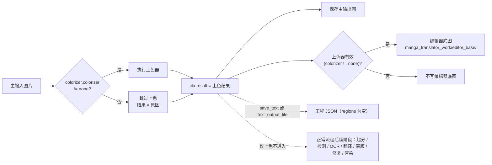

# 仅上色

当只需要给整批图片上色、暂时不需要检测文字、OCR、翻译、修复和渲染时，使用“仅上色”（Colorize Only）工作流。它在翻译页“翻译流程模式：”下拉框中位于“导入翻译并渲染”之后，开始按钮显示“开始上色”。该模式只执行上色阶段，然后立即返回并保存主输出图；它不会因为选择了本模式而强制启用上色器，`colorizer.colorizer` 为 `none` 时结果是原图。

“仅上色”与“仅超分”“仅修复”同属只做单个处理阶段的工作流，区别见[仅超分](./upscale-only.md)和[仅修复](./inpaint-only.md)；九种工作流的整体边界见[输出目录与工作流](../desktop/translation/output-directory-and-workflow.md)，汇总表见[工作流矩阵](../reference/workflow-matrix.md)。上色器类型、上色大小、降噪强度等参数见[超分与上色](../desktop/settings/upscale-and-colorization.md)，九种模式对参数的强制覆盖见[模式专用工作流与模板对齐](../desktop/settings/mode-specific.md)。

## 功能边界

- 输入：主输入图片（与正常翻译相同的文件发现规则：递归查找受支持扩展名、自然排序、跳过名为 `manga_translator_work` 的目录）。
- 执行阶段：上色（条件执行）。是否实际上色由 `colorizer.colorizer` 决定；为 `none` 时结果为原图。
- 跳过阶段：超分、检测、OCR、文本行合并、翻译、蒙版细化、修复、渲染。源码中仅上色分支位于上色之后、超分之前，因此即使设置了 `upscale_ratio` 也不会执行超分。
- 输出文件：主输出图；上色器有效（`colorizer != none`）时写编辑器底图 `manga_translator_work/editor_base/<原文件名>`；`cli.save_text` 启用时批量路径还会写空 `regions` 的工程 JSON（静态源码结论，待运行验证）。
- 工作流字段：下拉框索引 5 写入 `cli.colorize_only=true`；GUI 切换保证八个工作流布尔字段互斥。

## UI 操作

### 选择仅上色工作流

1. 打开“翻译”页，在“翻译流程模式：”（`Translation Workflow Mode:`）下拉框中选择“仅上色”（`Colorize Only`）。
2. 页面标题变为“仅上色”（`Colorize Only`），副标题显示提示：仅对图片进行上色处理，不进行检测、OCR、翻译和渲染。
3. 开始按钮变为“开始上色”（`Start Colorizing`）；点击后按该模式启动后端任务。

选择模式只写入配置并更新界面文案，不会自动开始任务。开始前应先添加主输入图片（“添加文件…”“添加文件夹…”或拖放），并在“输出目录:”中填写或拖入输出文件夹。若上色器选择 `openai_colorizer` / `gemini_colorizer`，还需要在 API 管理中配置对应 Key；i18n 说明文案提到缺少 Key 时 UI 不会开始翻译，本工作流启动时是否执行同样的阻断检查待运行验证。

### 界面文案中英对照

| UI 调用 key | English 实际值 | 简体中文实际值 |
| --- | --- | --- |
| `Translation Workflow Mode:` | Translation Workflow Mode: | 翻译流程模式： |
| `Colorize Only` | Colorize Only | 仅上色 |
| `Start Colorizing` | Start Colorizing | 开始上色 |
| `Tip: Only colorize images, no detection, OCR, translation or rendering` | Tip: Only colorize images, no detection, OCR, translation or rendering | 提示：仅对图片进行上色处理，不进行检测、OCR、翻译和渲染 |
| `label_colorizer` | Colorization Model | 上色模型 |
| `label_colorization_size` | Colorization Size | 上色大小 |
| `label_denoise_sigma` | Denoise Strength | 降噪强度 |
| `label_ai_colorizer_history_pages` | AI Colorizer History Pages | AI 上色历史页数 |
| `label_overwrite` | Overwrite Existing Files | 覆盖已存在文件 |
| `label_save_text` | Editable Image | 图片可编辑 |
| `label_batch_concurrent` | Concurrent Batch Processing | 并发批量处理 |

## 选项中英对照

下拉框没有独立 `userData`，索引就是模式值；运行时代码把索引 5 映射到 `cli.colorize_only=true`。相关设置的存储值如下表，三列 UI 证据与作用并列。

| 存储值 | English | 简体中文 | 本工作流中的实际作用 |
| --- | --- | --- | --- |
| `colorize_only=true` | Colorize Only | 仅上色 | 进入仅上色分支，跳过超分、检测、OCR、翻译、蒙版、修复和渲染 |
| `colorizer.colorizer=none` | None | 不使用 | 不执行上色，结果为原图，不写编辑器底图 |
| `colorizer.colorizer=mc2` | Manga Colorization v2 | Manga Colorization v2 | 离线上色模型 |
| `colorizer.colorizer=openai_colorizer` | OpenAI Colorizer | OpenAI Colorizer | OpenAI AI 上色，需要对应 API Key |
| `colorizer.colorizer=gemini_colorizer` | Gemini Colorizer | Gemini Colorizer | Gemini AI 上色，需要对应 API Key |
| `cli.overwrite=false` | Overwrite Existing Files | 覆盖已存在文件 | 开始前按主输出图是否存在过滤图片 |
| `cli.save_text=true` | Editable Image | 图片可编辑 | Qt/发行默认 `true`；批量路径写空 `regions` 的工程 JSON（静态结论） |
| `cli.batch_concurrent=true` | Concurrent Batch Processing | 并发批量处理 | 本模式强制按非并发处理 |

## 运行机理

### 处理阶段与输出

仅上色复用 `_translate_until_translation()` 的上色步骤，然后在上色器执行完、超分开始前提前返回。下面的 Mermaid 展示源码确认的阶段顺序、结果赋值和输出分支；虚线表示“仅上色不进入”的正常流程后续阶段。

上图表达的是源码确认的分支：`colorize_only=true` 时，`_translate_until_translation()` 在上色后把 `ctx.result` 设为上色结果、把 `ctx.text_regions` 设为空列表、报告进度状态 `colorize-only-complete`（核心内部完成状态，桌面 locale 中没有对应的专门文案），必要时写编辑器底图，然后返回；批量路径不会再调用 `_complete_translation_pipeline()`，也不会执行超分、检测、OCR、翻译、蒙版、修复或渲染。`colorizer.colorizer=none` 时上色步骤被跳过，`ctx.img_colorized = ctx.input`，结果就是原图。

### 与并发和互斥的关系

- `batch_concurrent` 不兼容：桌面控制层和核心 `translate_batch()` 都把“仅上色”列入不兼容模式清单，强制按非并发处理；界面仍保存并发配置也不会变成并发管线。
- 手工叠加多个工作流字段不是受支持组合。GUI 切换时八个字段互斥；在核心分派中仅上色分支在仅超分和仅修复分支之前返回，因此与 `upscale_only`、`inpaint_only` 同时开启时只有仅上色行为生效，文档不把这种叠加描述为受支持组合。
- 与正常翻译一样，上色是否执行由 `colorizer.colorizer` 决定；仅上色不会强制选择上色器。正常、仅超分、仅修复和替换翻译也会在 `colorizer.colorizer != none` 时先上色，这是上色阶段本身的行为，不是本工作流独有。

## 依赖与冲突

- `colorizer.colorizer=none`：不执行上色，输出就是原图，也不写编辑器底图；这是“仅上色”不强制上色器的直接后果。
- AI 上色器：`openai_colorizer` / `gemini_colorizer` 需要对应的 API Key（`.env`）和可用网络；i18n 说明提到缺少 Key 时 UI 不会开始翻译，本工作流启动时的实际阻断提示待运行验证。
- `upscale_ratio`：仅上色分支在超分之前返回，因此本模式下超分设置被忽略。
- `cli.overwrite=false`：GUI 开始前按主输出图（`_calculate_output_path` 的结果）过滤已存在文件；全部被跳过时会在翻译开始前结束。
- `cli.save_text`：Qt/发行默认 `true`；批量保存路径会写包含空 `regions` 的工程 JSON（静态源码结论，空 regions JSON 的实际内容与编辑器行为待运行验证）。
- 无文本区域意味着不产生检测、OCR、翻译、蒙版、修复、渲染相关的中间文件：不写修复图、原文/译文 TXT 或模板导出文件。
- PSD 导出（`export_editable_psd`）属于通用保存逻辑 `_save_and_cleanup_context()`，本模式无文本区域时的实际 PSD 内容未运行验证。
- 上色模型、显存、网络和 API 成本由 `colorizer.colorizer` 及上色参数决定，本页不重复其参数说明。

## 关联文件与格式

| 文件/格式 | 本页实际作用 | 说明 |
| --- | --- | --- |
| 主输出图 | 上色结果（或原图） | 路径由输出目录、`save_to_source_dir`、`cli.format` 决定 |
| `manga_translator_work/editor_base/<原文件名>` | 上色后供编辑器使用的底图 | 仅 `colorizer.colorizer != none` 时写入，保留原扩展名 |
| `manga_translator_work/json/<stem>_translations.json` | 工程 JSON（regions 为空） | 仅 `save_text` 或 `text_output_file` 启用时写入（静态结论） |
| 修复图 / 原文与译文 TXT / 模板导出 | 不产出 | 本模式不执行检测、OCR、翻译、修复和渲染 |

不在本页展示真实用户配置、密钥、令牌、用户名、私有绝对路径、用户图片或任务产物。

## 源码依据 {#source-evidence}

| 层级 | 文件 | 本页核对内容 |
| --- | --- | --- |
| 工作流选择与写入 | `desktop_qt_ui/ui/main_page/runtime.py:21-47,151-238` | 索引 5 → `colorize_only=true`、八字段互斥、标题/提示/开始按钮文案 |
| 翻译页布局 | `desktop_qt_ui/ui/main_page/pages/translation_page.py:27-113` | 页头标题/提示、工作流下拉、输出目录控件和开始按钮 |
| i18n | `desktop_qt_ui/locales/en_US.json:488-501,686`；`desktop_qt_ui/locales/zh_CN.json:486-499,684` | 工作流、提示、开始按钮和相关设置项的实际双语值 |
| 控制层 | `desktop_qt_ui/app_logic.py:3094-3288` | `save_info`、主输出图覆盖过滤、模式/提示和并发禁用 |
| Qt 配置 | `desktop_qt_ui/core/config_models.py:123-147` | `colorize_only`、`overwrite`、`save_text`、`batch_concurrent` 默认值 |
| 核心配置 | `manga_translator/config.py:106-113,378-387,388-425` | `Colorizer` 枚举、`ColorizerConfig`、`CliConfig` |
| 核心分支 | `manga_translator/manga_translator.py:4236-4332` | `_translate_until_translation()` 中上色与仅上色提前返回 |
| 批量保存 | `manga_translator/manga_translator.py:4195-4220` | 跳过渲染管线、保存主输出图、`save_text` 时写 JSON |
| 批量分派 | `manga_translator/manga_translator.py:3399-3520` | 特殊模式优先级与并发不兼容判定 |
| 输出路径 | `manga_translator/manga_translator.py:540-599` | `_calculate_output_path()` 输出目录与格式 |
| 编辑器底图 | `manga_translator/manga_translator.py:1074-1096` | `_save_work_image()`、`_save_editor_base_if_needed()` |
| 路径 | `manga_translator/utils/path_manager.py:95-127` | 工作目录、`editor_base` 路径与旧位置回退 |

## 验证记录 {#verification}

| 验证内容 | 状态 | 说明 |
| --- | --- | --- |
| BLUEPRINT、PAGE_GUIDELINES、TODO | 完成 | 已完整读取并按页面合同编写；不修改三份合同文件 |
| 源码与研究资料 | 完成 | 已核对 `workflow-matrix-source-evidence.md`、`phase0-related-files-formats-debug-safety.md` 及 UI、i18n、控制层和核心源码 |
| i18n 三列证据 | 完成 | 工作流选项、提示、开始按钮和相关设置均记录调用 key、English、简体中文实际值 |
| 路由/页面镜像 | 待运行 | 完成页面后运行 route mirror 和 source evidence 检查 |
| 脱敏运行验证 | 待后续 | 实际上色输出、覆盖/错误弹窗、空 `regions` JSON、AI 上色 Key 阻断提示需脱敏运行验证 |
| 生产构建 | 待运行 | 必要时运行 `npm run docs:build --prefix doc/wiki` |

- [ ] [进行中] 运行态待确认：上色器为 `none` 时的输出与提示、空 `regions` JSON 的实际内容、覆盖/错误弹窗和 AI 上色缺少 Key 时的阻断行为。