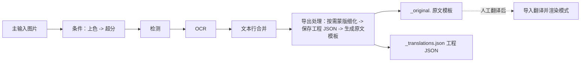

# 导出原文

当你想把原图上的文字先导出为文本、在外部人工翻译后再渲染回来时，使用“导出原文”模式。这是九种工作流中的“导出原图（export-original）”工作流，界面中的名称是“导出原文 / Export Original Text”。它只对主输入图片执行条件上色/超分、检测、OCR 和文本行合并，然后跳过翻译、修复和渲染，写出每张图的工程 JSON 和 `<stem>_original.<template-format>` 原文模板；人工翻译这些模板后，再用[导入翻译并渲染](./import-translation-and-render.md)读回并渲染。

九个模式的整体对照和输出目录设置见[输出目录与工作流](../desktop/translation/output-directory-and-workflow.md)；`cli.template` 与 `cli.save_text` 的参数说明见[模式专属工作流与模板对齐](../desktop/settings/mode-specific.md#cli-template)和[CLI 批量与输出](../desktop/settings/cli-batch-and-output.md#cli-save-text)。

## 功能边界 {#feature-boundary}

- 本页只覆盖九种工作流中的“导出原文 / Export Original Text”（下拉框索引 `2`）。选择该模式时，界面先清空八个互斥工作流字段，再只把 `cli.template` 设为 `true` 并保存配置；运行时要同时满足 `cli.save_text=true` 才进入导出分支。
- 输入是主输入图片与可读取的翻译模板；输出是工程 JSON 与原文副文件，不写主输出图。每张图以输入图片的不含扩展名 `<stem>` 组织工作目录。
- 本页不重复检测、OCR、上色、超分、蒙版、修复或渲染各自的参数算法；工作流选择不是翻译器选择，也不是 API 候选槽切换（见[翻译器选择](../desktop/translator/selection-and-languages.md)）。

## UI 操作 {#ui-operations}

### 选择导出原文工作流 {#select-export-original}

1. 打开“翻译”页（`Translation`），在“翻译任务”（`Translation Task`）卡片中点击“翻译流程模式：”（`Translation Workflow Mode:`）下拉框。
2. 选择“导出原文”（`Export Original Text`）。切换时界面只把 `cli.template` 设为 `true`，其余七个工作流字段清为 `false` 并保存配置；标题变为“导出原文”，副标题显示对应提示。
3. 点击“仅生成原文模板”（`Generate Original Text Template`）开始按钮启动任务。切换模式不会自动开始任务；任务进行中按钮会变为“停止翻译”（`Stop Translation`）等状态，见[进度、停止与任务状态](../desktop/translation/progress-stop-and-task-state.md)。

| UI 调用 key | English 实际值 | 简体中文实际值 |
| --- | --- | --- |
| `Translation Workflow Mode:` | Translation Workflow Mode: | 翻译流程模式： |
| `Export Original Text` | Export Original Text | 导出原文 |
| `Generate Original Text Template` | Generate Original Text Template | 仅生成原文模板 |
| `Tip: After exporting, manually translate imagename_original.txt in manga_translator_work/originals/, then use 'Import Translation and Render' mode` | Tip: After exporting, manually translate imagename_original.txt in manga_translator_work/originals/, then use 'Import Translation and Render' mode | 提示：导出原文后，可在 manga_translator_work/originals/ 目录手动翻译 图片名_original.txt 文件，然后使用「导入翻译并渲染」模式 |

提示中的 `imagename` / `图片名` 是程序对输入 `<stem>` 的示例称呼，不是用户私有文件名；`manga_translator_work/originals/` 是每图工作目录下的固定子目录名。

## 选项中英对照 {#option-matrix}

工作流下拉框没有独立 `userData`，索引即模式值。本工作流的存储值与写入字段如下：

| 存储值 | English | 简体中文 | 写入的工作流字段 | 开始按钮（English / 简体中文） |
| --- | --- | --- | --- | --- |
| `2` | Export Original Text | 导出原文 | `template=true`（且需要 `save_text=true`） | Generate Original Text Template / 仅生成原文模板 |

相关的设置项（设置 → Mode Specific 或 CLI 分组）：

| UI 调用 key | English 实际值 | 简体中文实际值 |
| --- | --- | --- |
| `label_template` | Export Original Text | 导出原文 |
| `label_save_text` | Editable Image | 图片可编辑 |
| `desc_cli_save_text` | Save translation results to JSON file for later editing in the editor. | 保存翻译结果到 JSON 文件，用于后续在编辑器中修改。 |
| `label_overwrite` | Overwrite Existing Files | 覆盖已存在文件 |

## 运行机理 {#runtime-behavior}

“导出原文”只有在 `template=true` **且** `save_text=true` 时才进入导出分支（源码中的 `is_template_save_mode`）。核心 `translate_batch()` 会强制 `batch_size=1` 逐张落盘，并把该模式列为 `batch_concurrent` 不兼容；桌面控制层也会把本次并发局部变量改为 `false`。高质量翻译流程同样会因导入/导出模式被跳过。

上图只表达源码确认的阶段顺序：`_translate_until_translation()` 完成条件上色/超分、检测、OCR 和文本行合并；`_handle_template_and_save_text()` 再按需细化蒙版、保存 JSON 并生成原文模板。没有文本区域时仍会保存空 JSON 并生成空模板文件。

### 输入与发现规则 {#input-and-discovery}

- 主输入必须是文件服务支持的图片；添加文件夹时递归查找并按自然排序收集，跳过名为 `manga_translator_work` 的目录。压缩包和文档扩展名由同一服务识别，但压缩包内副文件与本工作流的配对尚未运行验证。
- 每图工作目录以输入图片的原始路径和不含扩展名的 `<stem>` 为基准：原文副文件写入 `manga_translator_work/originals/<stem>_original.<template-format>`。
- 需要可读取的模板文件；`config/translation_template.json` 缺失或无法读取时，`output_format` 回退为 `json`。
- 启用 `detector.import_yolo_labels` 且导入到 YOLO 标注时，检测阶段直接用导入框替代检测器结果，并标记为“template mode”。

### 跳过与保留的阶段 {#skipped-and-kept-stages}

- 跳过：翻译、修复、渲染和主输出图保存；不调用翻译服务，因此不产生 API 翻译请求。
- 保留：条件上色 → 条件超分 → 检测 → OCR → 文本行合并；有非空区域且有原始蒙版时执行蒙版细化。
- 例外：导入 YOLO 标签的导出模式跳过蒙版细化且不在 JSON 中保存蒙版。
- 边界：GUI 只设置 `template`，Qt/发行配置默认 `save_text=true`；若外部配置把 `save_text` 改为 `false`，将不会进入导出分支，实际退化路径需运行验证。

### 蒙版与 JSON 细节 {#mask-and-json-details}

- 工程 JSON 由 `_save_text_to_file()` 写入 `manga_translator_work/json/<stem>_translations.json`（新位置优先，回退图片同级旧位置）。
- 导出原文会在 JSON 中写入 `skip_font_scaling=false`，让后续导入渲染重新执行智能排版，不继承旧字号；因为翻译未运行，区域 `translation` 仍是原始值。
- 蒙版保存的是细化后的 `ctx.mask`（`mask_is_refined=true`），没有细化结果时保存原始 `mask_raw`（`mask_is_refined=false`）；导入 YOLO 标签的导出模式不保存蒙版。
- `generate_original_text()` 按模板把每个区域写成 `<original>` 行，`translation` 为空时用原文作为占位符；没有文本区域时记录日志并生成空文件。

### 输出文件 {#output-files}

| 输出 | 路径 | 说明 |
| --- | --- | --- |
| 工程 JSON | `manga_translator_work/json/<stem>_translations.json` | 区域、尺寸、蒙版和导出标记；导入渲染时读取 |
| 原文模板 | `manga_translator_work/originals/<stem>_original.<template-format>` | 扩展名由模板 `output_format` 决定，默认 `json`；无文本区域时生成空文件 |
| 主输出图 | 不写 | 渲染被跳过，导出不生成主图 |
| 编辑器底图 | `manga_translator_work/editor_base/<原图文件名>` | 仅当启用上色或超分时条件写入 |

## 依赖与冲突 {#dependencies-and-conflicts}

- 依赖 `cli.save_text=true` 与可读取模板；`batch_concurrent` 不兼容，前端与核心都会按非并发处理，导出原文还强制 `batch_size=1`。
- `cli.overwrite=false` 时，开始前检查 `<stem>_original.<template-format>` 是否存在，存在则跳过该图并记入 skipped。
- 与导出翻译共享模板和 JSON 写入路径；与导入翻译并渲染构成“导出原文 → 人工翻译 → 导入渲染”的配对，见[导入翻译并渲染](./import-translation-and-render.md)。
- 显示名称描述“目标”，不自动启用或关闭上色/超分模型；上色器与倍率仍由 `colorizer.colorizer`、`upscale.upscale_ratio` 等常规参数决定。

## 关联文件与格式 {#related-files-and-formats}

| 文件/格式 | 本页实际作用 | 手改与兼容注意 |
| --- | --- | --- |
| `config/translation_template.json` | 决定 `output_format` 与 `<original>`/`<translated>` 占位符 | 首个 `output_format:` 行必须是安全扩展名，缺失/非法回退 `json`；不写入私有路径 |
| `manga_translator_work/originals/<stem>_original.<format>` | 原文模板输出，供人工翻译 | 文件名必须与输入 `<stem>` 匹配；导入翻译并渲染时优先读取 |
| `manga_translator_work/json/<stem>_translations.json` | 工程 JSON 输出 | 新位置优先，兼容图片同级旧位置 |
| `manga_translator_work/editor_base/` | 条件写入的编辑器底图 | 仅上色/超分启用时产生 |
| `manga_translator_work/yolo_labels/<stem>.txt` | 导入 YOLO 标注输入 | 仅 `import_yolo_labels=true` 时参与检测 |

不在本页展示真实用户配置、密钥、令牌、用户名、私有绝对路径、用户图片或任务产物；当前没有用于本页的真实运行截图，不得用示意图冒充运行截图。

## 源码依据 {#source-evidence}

| 层级 | 文件 | 本页核对内容 |
| --- | --- | --- |
| UI 布局 | `desktop_qt_ui/ui/main_page/pages/translation_page.py:64-110` | 翻译任务卡片、工作流下拉、开始按钮 |
| 工作流状态/写入 | `desktop_qt_ui/ui/main_page/runtime.py:21-47,151-215` | 索引 `2` 映射 `template=true`、提示和按钮文案 |
| i18n | `desktop_qt_ui/locales/en_US.json`、`zh_CN.json` | 下拉、提示、按钮和设置项的实际双语值 |
| 控制层 | `desktop_qt_ui/app_logic.py:3149,3244-3270` | 覆盖前检查、`is_template_save_mode`、并发禁用 |
| Qt 配置 | `desktop_qt_ui/core/config_models.py:123` | `template`、`save_text`、`overwrite` 默认值 |
| 核心分派 | `manga_translator/manga_translator.py:799,3448-3510,4090-4130` | 导出分支条件、`batch_size=1`、跳过翻译/渲染、导出处理 |
| 模板导出 | `desktop_qt_ui/services/workflow_service.py:305-398` | `generate_original_text()`、占位符、空文件行为 |
| 路径 | `manga_translator/utils/path_manager.py:178-201` | `get_original_txt_path()`、工作目录与 `originals` 子目录 |
| 模板格式 | `manga_translator/utils/translation_template.py:10-65` | `output_format` 解析与回退 |

## 验证记录 {#verification}

| 验证内容 | 状态 | 说明 |
| --- | --- | --- |
| BLUEPRINT、PAGE_GUIDELINES、TODO | 完成 | 已完整读取并按页面合同编写 |
| UI 与 i18n 三列 | 完成 | 静态核对 `translation_page.py`、`runtime.py` 与两个 locale 的实际值 |
| 运行链（静态） | 完成 | 核对 `translate_batch()` 分支、`_handle_template_and_save_text()` 与模板生成 |
| 脱敏运行验证 | 待后续 | 未启动 GUI、未读取真实 `.env`、用户 `config.json`、密钥或用户图片；GUI 提示、覆盖弹窗与 `save_text=false` 退化路径待运行核对 |
| 路由/源码检查 | 待运行 | 完成后运行 route mirror 与 source evidence 检查 |
| VitePress 构建 | 待运行 | 由协调代理在合并前运行 `npm run docs:build --prefix doc/wiki` |

- [ ] [进行中] 运行态待确认：GUI 提示与覆盖弹窗、`save_text=false` 时的退化路径、压缩包输入下副文件配对。