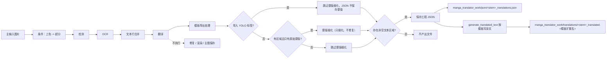

# 导出译文

当只需要批量取得“图片文字翻译成目标语言后的文本”，暂时不需要修复、排版和渲染成图时，使用“导出翻译”工作流。它仍会执行条件上色、条件超分、检测、OCR 和翻译，但跳过修复、渲染和主输出图保存，把每张图的译文按模板写入工作目录的 `translations/` 副文件，同时保存工程 JSON。

“导出翻译”与“导出原文”“仅翻译（JSON）”“导入翻译并渲染”构成模板/JSON 家族，区别见[导出原文](./export-original.md)、[仅翻译（JSON）](./translate-json-only.md)和[导入翻译并渲染](./import-translation-and-render.md)；九种工作流的整体边界见[输出目录与工作流](../desktop/translation/output-directory-and-workflow.md)，汇总表见[工作流矩阵](../reference/workflow-matrix.md)。

## 功能边界

- 输入：主输入图片（与正常翻译相同的文件发现规则），以及可读取的导出模板 `config/translation_template.json`。
- 执行阶段：条件上色 → 条件超分 → 检测 → OCR → 文本行合并 → 翻译；有文本区域且只有原始蒙版时会细化蒙版。
- 跳过阶段：修复、渲染、主输出图保存。翻译结果只落到工程 JSON 和译文副文件，不生成最终成图。
- 输出文件：`manga_translator_work/json/<stem>_translations.json` 和 `manga_translator_work/translations/<stem>_translated.<模板扩展名>`。
- 工作流字段：下拉框第 1 项，运行时写入 `cli.generate_and_export=true`；GUI 切换保证八个工作流布尔字段互斥。

## UI 操作

### 选择导出译文工作流

1. 打开翻译页，在“翻译流程模式：”（`Translation Workflow Mode:`）下拉框中选择“导出翻译”（`Export Translation`）。
2. 页面标题变为“导出翻译”，副标题显示提示：导出翻译后可在 `manga_translator_work/translations/` 目录查看译文副文件。
3. 开始按钮变为“导出翻译”（`Export Translation`）；点击后按该模式启动后端任务。

选择模式只写入配置并更新界面文案，不会自动开始任务。开始前应先添加主输入图片（“添加文件…”“添加文件夹…”或拖放），并保证导出模板存在或可解析。界面提示固定写作 `imagename_translated.txt`，但实际扩展名由模板的 `output_format` 决定（默认 `json`），提示文案不随模板扩展名变化。

“输出目录:”只决定主输出图的位置；导出翻译不写主图，因此本模式下它不影响 JSON 与译文副文件位置，这两类文件始终按输入图片的工作目录规则写入。

| UI 调用 key | English 实际值 | 简体中文实际值 |
| --- | --- | --- |
| `Translation Workflow Mode:` | Translation Workflow Mode: | 翻译流程模式： |
| `Export Translation` | Export Translation | 导出翻译 |
| `Tip: After exporting, check manga_translator_work/translations/ for imagename_translated.txt files` | Tip: After exporting, check manga_translator_work/translations/ for imagename_translated.txt files | 提示：导出翻译后，可在 manga_translator_work/translations/ 目录查看 图片名_translated.txt 文件 |
| `label_generate_and_export` | Export Translation | 导出翻译 |
| `label_overwrite` | Overwrite Existing Files | 覆盖已存在文件 |
| `label_import_yolo_labels` | Import Fixed YOLO Boxes | 导入固定YOLO框 |
| `label_batch_concurrent` | Concurrent Batch Processing | 并发批量处理 |

## 选项中英对照

下拉框没有独立 `userData`，索引就是模式值；运行时代码把索引 1 映射到 `cli.generate_and_export=true`。相关设置的存储值如下表，三列 UI 证据与作用并列。

| 存储值 | English | 简体中文 | 本工作流中的实际作用 |
| --- | --- | --- | --- |
| `generate_and_export=true` | Export Translation | 导出翻译 | 进入导出分支，跳过修复、渲染和主图保存 |
| `overwrite=false` | Overwrite Existing Files | 覆盖已存在文件 | 开始前跳过已存在译文副文件的图片 |
| `import_yolo_labels=true` | Import Fixed YOLO Boxes | 导入固定YOLO框 | 跳过蒙版细化，JSON 不保存蒙版 |
| `batch_concurrent=true` | Concurrent Batch Processing | 并发批量处理 | 本模式强制按非并发处理 |

## 运行机理

### 处理阶段与输出

导出翻译复用正常翻译的前半段流水线，然后在模板导出处理器中收尾。下面的 Mermaid 展示源码确认的阶段顺序、蒙版分支和输出文件；它与导出原文共享 `_handle_template_export`，但以 `ensure_json_with_empty_regions=false` 调用，因此无文本区域时不产出文件（导出原文则写出空模板）。

### 模板导出细节

- 模板路径解析顺序：用户指定路径 > `MANGA_TEMPLATE_PATH` 环境变量 > 默认 `config/translation_template.json`。
- 模板首个 `output_format:` 行决定副文件扩展名；合法值为安全的 1–32 字符扩展名，缺失或非法时回退 `json`。
- `generate_translated_text()` 从工程 JSON 的 `regions` 收集条目：只包含非空原文区域，原文和译文都移除 `[BR]` 标记；`<original>` 填原文、`<translated>` 填译文，译文为空时导出空串（不回退原文，这与导出原文不同）。
- 模板必须至少包含一行 `<original>` 占位符，否则解析抛错，导出日志记为 “Failed to export clean text”。
- 内置默认模板的 `output_format` 为 `json`，占位符结构为 `<original>` / `<translated>` 行。

### 导出翻译写入的 JSON 字段

- `skip_font_scaling=true`：导出翻译保留固定字号，便于后续按已生成结果回放；导出原文和仅翻译（JSON）则写 `false`。
- 蒙版：`save_mask` 开启时保存 base64 蒙版与 `mask_is_refined`；导入 YOLO 标签的导出模式跳过蒙版保存。
- 启用上色或超分时，JSON 记录 `colorizer`、`upscale_ratio`、`upscaler`。
- 本模式不渲染，因此不写 `skip_text_replacements`；已有 JSON 中的画笔/印章图层会被保留。

### 与并发和互斥的关系

- `batch_concurrent` 不兼容：桌面控制层和 `translate_batch()` 都把它视为不兼容模式，强制按非并发处理；界面仍保存并发配置也不会变成并发管线。
- 手工叠加多个工作流字段不是受支持组合。运行时 `translate_batch()` 的分派顺序里，导出原文分支先于导出翻译分支；GUI 切换时八个字段互斥。
- 与正常翻译一样，预处理阶段仍会按 `colorizer.colorizer` 和 `upscale.upscale_ratio` 执行条件上色与超分；这些值不是本工作流的强制开关。

## 依赖与冲突

- 模板依赖：模板缺失时导出步骤记录警告，工程 JSON 仍会保存；模板不可解析时译文副文件不产出。
- 无文本区域：本模式以 `ensure_json_with_empty_regions=false` 调用共享导出流程，文本区域为空时不写 JSON 和译文副文件；这与导出原文写出空模板的行为不同（静态源码结论，空区域下的运行提示待验证）。
- `cli.overwrite=false`：GUI 开始前跳过译文副文件已存在的图片（检查 `get_translated_txt_path`，即按模板扩展名生成的目标文件）。
- `cli.save_text`：本模式进入导出分支不依赖 `save_text`，JSON 和译文副文件在导出分支内无条件写出；这与导出原文要求 `template=true` 且 `save_text=true` 不同。
- 上色、超分、检测、OCR、翻译仍按所选参数产生模型、显存、网络和 API 成本；本页不重复其参数说明。
- 主输出目录、`save_to_source_dir`、`cli.format` 只影响主输出图；本模式不写主图，因此这些设置对本工作流输出无直接影响。

## 关联文件与格式

| 文件/格式 | 本页实际作用 | 说明 |
| --- | --- | --- |
| `config/translation_template.json` | 决定译文副文件扩展名和占位符结构 | 首个 `output_format:` 行为扩展名；缺失/非法回退 `json` |
| `manga_translator_work/json/<stem>_translations.json` | 工程 JSON，含 `regions`、蒙版和 `skip_font_scaling` | 新位置优先，回退图片同级旧位置 |
| `manga_translator_work/translations/<stem>_translated.<模板扩展名>` | 译文导出副文件 | 扩展名来自模板；界面提示里的 `.txt` 是固定文案 |
| 主输出图 | 不产出 | 本模式跳过主图保存 |

不在本页展示真实用户配置、密钥、令牌、用户名、私有绝对路径、用户图片或任务产物。

## 源码依据

| 层级 | 文件 | 本页核对内容 |
| --- | --- | --- |
| 工作流选择与写入 | `desktop_qt_ui/ui/main_page/runtime.py:183-215` | 索引 1 → `generate_and_export=true`、八字段互斥和配置保存 |
| 标题、提示与开始按钮 | `desktop_qt_ui/ui/main_page/runtime.py:22-47,219-238` | “Export Translation”标题、提示调用 key 和按钮文案 |
| i18n | `desktop_qt_ui/locales/en_US.json`、`zh_CN.json` | `Export Translation`、`Tip: After exporting...`、`label_*` 实际双语值 |
| 控制层 | `desktop_qt_ui/app_logic.py:3157-3162,3222,3245-3272` | 覆盖前检查译文副文件、工作流提示、特殊模式并发禁用 |
| 核心分派 | `manga_translator/manga_translator.py:4151,5770` | 标准与 HQ 路径的导出分支、跳过渲染 |
| 模板导出 | `manga_translator/manga_translator.py:960,1021` | `_handle_generate_and_export` → `_handle_template_export` 共享流程 |
| JSON 写入 | `manga_translator/manga_translator.py:713,803,829` | `_save_text_to_file`、`skip_font_scaling=true`、YOLO 蒙版例外 |
| 路径 | `manga_translator/utils/path_manager.py` | JSON/译文副文件路径、新位置与旧位置回退 |
| 模板解析与生成 | `manga_translator/utils/translation_template.py`、`desktop_qt_ui/services/workflow_service.py` | `output_format` 解析、`<original>/<translated>` 占位符、`generate_translated_text` |

## 验证记录

| 验证内容 | 状态 | 说明 |
| --- | --- | --- |
| BLUEPRINT、PAGE_GUIDELINES、TODO | 完成 | 已完整读取并按页面合同编写；不修改三份合同文件 |
| 源码与研究资料 | 完成 | 已核对 `workflow-matrix-source-evidence.md` 与 UI、i18n、控制层和核心源码 |
| i18n 三列证据 | 完成 | 工作流选项、提示、按钮和相关设置均记录调用 key、English、简体中文实际值 |
| 路由/页面镜像 | 待运行 | 完成页面后运行 route mirror 和 source evidence 检查 |
| 空区域与覆盖/错误提示 | 待运行 | `ensure_json_with_empty_regions` 空区域行为、覆盖提示和错误弹窗需脱敏运行验证 |
| 生产构建 | 待运行 | 必要时运行 `npm run docs:build --prefix doc/wiki` |

- [ ] [进行中] 运行态待确认：空文本区域的实际提示与文件保留、覆盖提示弹窗、模板缺失时的用户可见反馈。