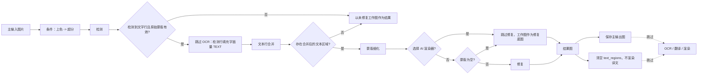

# 仅修复

当只需要把画面里的文字区域抹掉、保留干净的背景图，不需要识别文字内容、翻译或排版渲染时，使用“仅修复”（`Inpaint Only`）工作流。它仍然执行条件上色、条件超分、检测、文本行合并、蒙版细化和修复，但跳过 OCR、翻译与渲染，并在分支结束前清空文本区域，因此输出的是不含译文的无字图。

“仅修复”与“仅上色”“仅超分”都属于只处理图片的旁路模式，区别见[仅上色](./colorize-only.md)和[仅超分](./upscale-only.md)；与完整流水线的差异见[正常翻译流程](./normal.md)。九种工作流的整体边界见[输出目录与工作流](../desktop/translation/output-directory-and-workflow.md)，汇总表见[工作流矩阵](../reference/workflow-matrix.md)。蒙版与修复参数本身见[蒙版与图像修复](../desktop/settings/mask-and-inpainting.md)。

## 功能边界

- 输入：主输入图片（与正常翻译相同的文件发现规则），不需要工程 JSON、TXT 或配对图等任何工作流副文件前置。
- 执行阶段：条件上色（`colorizer.colorizer != none` 时）→ 条件超分（`upscale.upscale_ratio` 有值时）→ 检测 → 跳过 OCR、用字面量 `TEXT` 填充检测行 → 文本行合并 → 蒙版细化 → 修复。
- 跳过阶段：OCR、翻译、渲染和文本排版；分支结束前把 `text_regions` 清空，因此结果不会以译文渲染。
- 输出文件：主输出图（修复后的无字图；无文字行、无合并区域或选择 AI 渲染器时是未修复的工作图）；条件上色或超分启用时还会写编辑器底图；`save_text` 开启时写空 `regions` 的工程 JSON（静态源码结论，运行待验证）。
- 工作流字段：下拉框第 7 项，运行时写入 `cli.inpaint_only=true`；GUI 切换保证八个工作流布尔字段互斥。

## UI 操作

### 选择仅修复工作流

1. 打开翻译页，在“翻译流程模式：”（`Translation Workflow Mode:`）下拉框中选择“仅修复”（`Inpaint Only`）。
2. 页面标题变为“仅修复”，副标题显示提示“提示：仅检测文字并执行图像修复，输出无字干净图，不进行翻译和渲染”。
3. 开始按钮变为“开始修复”（`Start Inpainting`）；点击后按该模式启动后端任务。

选择模式只写入配置并更新界面文案，不会自动开始任务。开始前先添加主输入图片（“添加文件”“添加文件夹”或拖放），本模式不要求任何副文件。

“输出目录:”决定主输出图的位置，命名规则与正常翻译相同：正常输出目录下保留输入文件夹名与相对层级，`save_to_source_dir=true` 时改为原图同级 `manga_translator_work/result/`，`cli.format` 为空或 `none` 时保留原扩展名。

| UI 调用 key | English 实际值 | 简体中文实际值 |
| --- | --- | --- |
| `Translation Workflow Mode:` | Translation Workflow Mode: | 翻译流程模式： |
| `Choose translation workflow mode before starting the task.` | Choose translation workflow mode before starting the task. | 开始任务前请选择翻译流程模式。 |
| `Inpaint Only` | Inpaint Only | 仅修复 |
| `Tip: Detect text regions and inpaint to output clean images, no translation or rendering` | Tip: Detect text regions and inpaint to output clean images, no translation or rendering | 提示：仅检测文字并执行图像修复，输出无字干净图，不进行翻译和渲染 |
| `Start Inpainting` | Start Inpainting | 开始修复 |
| `Add Files` | Add Files | 添加文件 |
| `Add Folder` | Add Folder | 添加文件夹 |
| `Clear List` | Clear List | 清空列表 |
| `Output Directory:` | Output Directory: | 输出目录: |
| `Select or drag output folder...` | Select or drag output folder... | 选择或拖入输出文件夹... |
| `Browse...` | Browse... | 浏览... |
| `Open` | Open | 打开 |
| `label_overwrite` | Overwrite Existing Files | 覆盖已存在文件 |
| `label_batch_concurrent` | Concurrent Batch Processing | 并发批量处理 |
| `label_save_text` | Editable Image | 图片可编辑 |
| `label_inpainter` | Inpainting Model | 修复模型 |

## 选项中英对照

下拉框没有独立 `userData`，索引就是模式值；运行时代码把索引 7 映射到 `cli.inpaint_only=true`。相关设置的存储值如下表，三列 UI 证据与作用并列。

| 存储值 | English | 简体中文 | 本工作流中的实际作用 |
| --- | --- | --- | --- |
| `inpaint_only=true` | Inpaint Only | 仅修复 | 进入仅修复分支，跳过 OCR、翻译和渲染 |
| `overwrite=false` | Overwrite Existing Files | 覆盖已存在文件 | 开始前跳过主输出图已存在的图片 |
| `batch_concurrent=true` | Concurrent Batch Processing | 并发批量处理 | 本模式强制按非并发处理 |
| `save_text=true` | Editable Image | 图片可编辑 | Qt/发行默认开启；批量保存阶段仍会写入空 `regions` 的工程 JSON（静态源码结论） |
| `render.renderer` 为 AI 渲染器 | Renderer | 渲染器 | 选择 OpenAI/Gemini 渲染器时跳过真正的修复，以工作图作为修复底图 |

## 运行机理

### 处理阶段与输出

仅修复复用正常翻译的预处理前半段，然后在 `_translate_until_translation` 的“仅修复”分支中收尾。下面的 Mermaid 展示源码确认的阶段顺序、跳过分支和输出；它与正常翻译共享条件上色、条件超分和检测，但 OCR 与翻译被跳过。

- 分支对每个检测行填入字面量 `TEXT` 占位文本并跳过 OCR；文本行合并把检测行合并成 `text_regions`。
- 无文字行、无原始蒙版或无合并区域时，直接以未修复的工作图作为结果返回，不进入蒙版细化和修复。
- 蒙版细化失败时降级为简单膨胀，膨胀参数来自 `kernel_size` 与 `mask_dilation_offset`。
- 选择 AI 渲染器（OpenAI/Gemini）或蒙版为空时跳过真正的修复，工作图原样作为“修复底图”。
- 分支结束前清空 `text_regions` 并设置 `inpaint_only_complete` 标志；批量保存阶段跳过 `_complete_translation_pipeline`，不执行蒙版细化后的常规渲染。

### 蒙版与修复细节

- 蒙版细化与修复参数来自设置“修复”页签（修复模型、修复大小、修复精度、逐块修复、纯色气泡直接填色、遮罩扩张偏移等），详见[蒙版与图像修复](../desktop/settings/mask-and-inpainting.md)。
- 修复输入是条件上色/超分之后的工作图（`load_image(ctx.upscaled)`），不是原始输入图。
- 修复结果写入 `ctx.img_inpainted`，再转成 PIL 图像作为 `ctx.result` 保存为主输出图；本模式不额外写 `inpainted/` 修复图副文件。

### 与并发和互斥的关系

- `batch_concurrent` 不兼容：桌面控制层和 `translate_batch()` 都把它视为不兼容模式，强制按非并发处理；界面仍保存并发配置也不会变成并发管线。
- 手工叠加多个工作流字段不是受支持组合；GUI 切换时八个字段互斥，后端 `translate_batch()` 只在无任何不兼容模式时才构建并发流水线。
- 与正常翻译一样，预处理阶段仍会按 `colorizer.colorizer` 与 `upscale.upscale_ratio` 执行条件上色与超分；这些值不是本工作流的强制开关。

## 依赖与冲突

- 输入依赖：主输入必须是文件服务支持的图片；本模式不要求工程 JSON、TXT 或配对图等副文件。
- `cli.overwrite=false`：GUI 开始前检查主输出图是否已存在（与其他“只写主图”模式共用普通翻译的检查分支）。
- `cli.save_text`：Qt/发行默认 `true`。批量保存阶段在 `save_text` 开启时仍会写入空 `regions` 的工程 JSON（含蒙版与上色/超分信息），这是静态源码结论，实际 GUI 文件行为待运行验证。
- AI 渲染器：选中 OpenAI/Gemini 渲染器时，本模式不执行真正的修复，输出未修复的工作图；这与“仅修复”名称存在差异，属于源码确认的行为。
- 检测、蒙版细化和修复按所选参数产生模型与显存成本；OCR 和翻译被跳过，不产生对应成本。
- 主输出目录、`save_to_source_dir`、`cli.format` 只影响主输出图；本模式不写原文/译文 TXT，因此导出模板文件不影响本工作流。

## 关联文件与格式

| 文件/格式 | 本页实际作用 | 说明 |
| --- | --- | --- |
| 主输出图 | 修复后的无字图 | 路径由输出路径计算器决定；无文字行、无合并区域或 AI 渲染器时为未修复的工作图 |
| `manga_translator_work/json/<stem>_translations.json` | 工程 JSON（空 `regions`） | `save_text` 开启时写入；新位置优先，回退图片同级旧位置 |
| `manga_translator_work/editor_base/<原文件名>` | 上色/超分编辑器底图 | 条件上色或超分启用时写入，与仅上色/仅超分共享预处理逻辑 |
| `manga_translator_work/inpainted/` | 修复图副文件 | 本模式不写该副文件（正常翻译在修复完成时写） |
| 原文/译文 TXT | 不产出 | 本模式不执行模板导出 |

不在本页展示真实用户配置、密钥、令牌、用户名、私有绝对路径、用户图片或任务产物。

## 源码依据

| 层级 | 文件 | 本页核对内容 |
| --- | --- | --- |
| 工作流选择与写入 | `desktop_qt_ui/ui/main_page/runtime.py` | 索引 7 → `inpaint_only=true`、八字段互斥、标题/提示/开始按钮文案 |
| 翻译页 UI | `desktop_qt_ui/ui/main_page/pages/translation_page.py` | 工作流下拉、标题/副标题、输入按钮与开始按钮 |
| i18n | `desktop_qt_ui/locales/en_US.json`、`zh_CN.json` | `Inpaint Only`、`Start Inpainting`、提示与 `label_*` 实际双语值 |
| 控制层 | `desktop_qt_ui/app_logic.py` | 主输出图覆盖前检查、特殊模式并发禁用 |
| Qt 配置 | `desktop_qt_ui/core/config_models.py` | `inpaint_only` 与 `save_text` 默认值 |
| 核心分派 | `manga_translator/manga_translator.py:3399,3476,3505,4104,4195,5811` | 特殊模式优先级、并发限制、跳过翻译/渲染与 HQ 路径 |
| 仅修复分支 | `manga_translator/manga_translator.py:4367-4520` | 检测→填充 `TEXT`→合并→蒙版细化→修复、AI 渲染器与空蒙版分支 |
| 常规后处理 | `manga_translator/manga_translator.py:5213` | `inpaint_only_complete` 时跳过 `_complete_translation_pipeline` |
| 路径 | `manga_translator/utils/path_manager.py` | 主输出图与工程 JSON 路径、`manga_translator_work` 工作目录 |
| 发行配置 | `config/config-example.json` | `inpaint_only: false`、`save_text: true` 与修复器默认值 |

## 验证记录

| 验证内容 | 状态 | 说明 |
| --- | --- | --- |
| BLUEPRINT、PAGE_GUIDELINES、TODO | 完成 | 已完整读取并按页面合同编写；不修改三份合同文件 |
| 源码与研究资料 | 完成 | 已核对 `workflow-matrix-source-evidence.md` 与 UI、i18n、控制层和核心源码 |
| i18n 三列证据 | 完成 | 工作流选项、提示、按钮和相关设置均记录调用 key、English、简体中文实际值 |
| 路由/页面镜像 | 待运行 | 完成页面后运行 route mirror 和 source evidence 检查 |
| 空文字/空蒙版与 AI 渲染器分支 | 待运行 | 无文字行、无合并区域、AI 渲染器跳过修复的实际输出与提示需脱敏运行验证 |
| 生产构建 | 待运行 | 必要时运行 `npm run docs:build --prefix doc/wiki` |

- [ ] [进行中] 运行态待确认：无文字行/无合并区域时的提示与输出、AI 渲染器跳过修复的实际结果、`save_text` 空 `regions` JSON 的实际写入和覆盖提示弹窗。