# 正常翻译流程

“正常翻译流程”（Normal Translation）是翻译页“翻译流程模式：”下拉框的默认选项，也是九种工作流中唯一执行完整翻译链路的模式。需要从图片检测文字、识别并翻译、修复原文字区域并渲染译文时使用本模式；其余八个模式会跳过大部分阶段，总览见[输出目录与工作流](../desktop/translation/output-directory-and-workflow.md)。

本页只描述正常模式的输入、完整处理阶段、跳过条件和输出文件。添加文件、列表状态和拖拽见[文件列表与输入](../desktop/translation/file-list-and-input.md)，开始、停止、取消和进度状态见[进度、停止与任务状态](../desktop/translation/progress-stop-and-task-state.md)，各阶段的参数算法见对应的设置页（检测、OCR 过滤与合并、翻译、蒙版与修复、排版与渲染、超分与上色、CLI 批量与输出）。

## 功能边界

- 输入：主输入图片，通过“添加文件”“添加文件夹”或拖拽加入。添加文件夹时递归查找受支持的图片扩展名、按自然排序收集，并跳过名为 `manga_translator_work` 的目录。
- 处理阶段：条件上色 → 条件超分 → 检测 → OCR → 文本行合并 → 翻译 → 蒙版细化 → 修复 → 渲染 → 保存主输出图。
- 跳过条件：检测后无文本行、OCR 后无文本、翻译后区域为空、取消、AI renderer 跳过修复等，见下文“跳过条件”。
- 输出：主输出图；启用 `cli.save_text`（界面“图片可编辑”）时还写工程 JSON 和修复图；启用上色或超分时写编辑器底图。
- 正常模式是九种工作流中唯一允许进入 `batch_concurrent` 并发管线的模式；其余八个模式在桌面控制层和核心 `translate_batch()` 中都被视为不兼容，按非并发处理。
- 本页不解释各检测器、OCR、翻译器、修复器、渲染器的参数算法，那些内容在各设置页；工作流下拉框、输出目录控件和九种模式的互斥写入见[输出目录与工作流](../desktop/translation/output-directory-and-workflow.md)。

## UI 操作

### 添加输入并选择工作流

1. 打开“翻译”页签。页头默认标题为“正常翻译流程”（`Normal Translation`），副标题为“提示：标准翻译流程，会进行检测、OCR、翻译和渲染”（`Tip: Standard translation pipeline with detection, OCR, translation and rendering`）。
2. 点击“添加文件”（`Add Files`）或“添加文件夹”（`Add Folder`）加入图片，也可以直接拖入文件或文件夹；点击“清空列表”（`Clear List`）可清空当前列表。
3. 在“翻译流程模式：”（`Translation Workflow Mode:`）下拉框中确认选中“正常翻译流程”（`Normal Translation`）。切换下拉框时，GUI 会先把八个互斥的工作流字段全部清为 `false`，再只设置所选模式对应的字段并保存配置；正常模式对应八个字段全部为 `false`。
4. 在“输出目录:”（`Output Directory:`）输入框填写路径，或把输出文件夹拖入输入框；占位文案为“选择或拖入输出文件夹...”（`Select or drag output folder...`）。点击“浏览...”（`Browse...`）选择目录，点击“打开”（`Open`）调用系统打开该目录。
5. 点击“开始翻译”（`Start Translation`）开始任务。运行中按钮文案变为“停止翻译”（`Stop Translation`），再点击可请求停止，随后进入“停止中...”（`Stopping...`）状态。

### 界面文案中英对照

| UI 调用 key | English 实际值 | 简体中文实际值 |
| --- | --- | --- |
| `Translation Task` | Translation Task | 翻译任务 |
| `Normal Translation` | Normal Translation | 正常翻译流程 |
| `Translation Workflow Mode:` | Translation Workflow Mode: | 翻译流程模式： |
| `Add Files` | Add Files | 添加文件 |
| `Add Folder` | Add Folder | 添加文件夹 |
| `Clear List` | Clear List | 清空列表 |
| `Output Directory:` | Output Directory: | 输出目录: |
| `Select or drag output folder...` | Select or drag output folder... | 选择或拖入输出文件夹... |
| `Browse...` | Browse... | 浏览... |
| `Open` | Open | 打开 |
| `Start Translation` | Start Translation | 开始翻译 |
| `Stop Translation` | Stop Translation | 停止翻译 |
| `Stopping...` | Stopping... | 停止中... |
| `Tip: Standard translation pipeline with detection, OCR, translation and rendering` | Tip: Standard translation pipeline with detection, OCR, translation and rendering | 提示：标准翻译流程，会进行检测、OCR、翻译和渲染 |
| `🔧 Translation workflow: {mode}` | 🔧 Translation workflow: {mode} | 🔧 翻译流程：{mode} |
| `📁 Output directory: {dir}` | 📁 Output directory: {dir} | 📁 输出目录：{dir} |
| `label_batch_size` | Batch Size | 批量大小 |
| `label_batch_concurrent` | Concurrent Batch Processing | 并发批量处理 |
| `label_save_text` | Editable Image | 图片可编辑 |
| `label_overwrite` | Overwrite Existing Files | 覆盖已存在文件 |
| `label_save_to_source_dir` | Save to Source Directory | 输出到原图目录 |
| `label_format` | Output Format | 输出格式 |
| `label_skip_no_text` | Skip Images Without Text | 跳过无文本图像 |

“🔧 Translation workflow: {mode}”与“📁 Output directory: {dir}”是运行日志和进度消息里的固定前缀，不是普通控件文案；两者都在任务开始前后由控制层输出。

## 运行机理

### 主流水线

正常模式对每张图按以下顺序执行；上色、超分、修复是否实际发生由对应参数决定，不是模式强制。检测没有找到文本行、OCR 没有识别出文本时直接提前返回，不进入后续阶段。

```mermaid
flowchart LR
    Input["主输入图片"] --> Colorize{"colorizer.colorizer\n!= none?"}
    Colorize -- "否" --> UpscaleQ{"upscale.upscale_ratio\n非空?"}
    Colorize -- "是" --> Colorized["上色"]
    Colorized --> UpscaleQ
    UpscaleQ -- "否" --> Detect["检测"]
    UpscaleQ -- "是" --> Upscaled["超分"]
    Upscaled --> Detect
    Detect --> HasLines{"检测到文本行?"}
    HasLines -- "否" --> SkipRegion["跳过：输出输入图/超分图\n(skip-no-regions)"]
    HasLines -- "是" --> OCR["OCR"]
    OCR --> HasText{"识别出文本?"}
    HasText -- "否" --> SkipText["跳过：输出输入图/超分图\n(skip-no-text)"]
    HasText -- "是" --> Merge["文本行合并"]
    Merge --> Translate["翻译"]
    Translate --> Mask["蒙版细化"]
    Mask --> AIQ{"renderer 是\nAI renderer?"}
    AIQ -- "是" --> RenderBase["跳过修复：工作图作渲染底图"]
    AIQ -- "否" --> Inpaint["修复"]
    RenderBase --> Render["渲染"]
    Inpaint --> Render
    Render --> Output["主输出图"]
    Render -. "save_text 或 text_output_file" .-> Json["工程 JSON"]
    Inpaint -. "save_text" .-> Inpainted["修复图"]
    Colorized -. "上色或超分启用" .-> EditorBase["编辑器底图"]
    Upscaled -. "上色或超分启用" .-> EditorBase
```

上图表达的是源码确认的阶段顺序、跳过分支和输出分支，不代表每次运行都经过全部阶段：`colorizer.colorizer=none`、`upscale_ratio` 为空、无文本、AI renderer 和取消都会走相应旁路。修复图和编辑器底图只在对应条件下写入；文档没有伪造运行截图或私有任务产物。

### 跳过条件

| 条件 | 触发点 | 结果 |
| --- | --- | --- |
| 检测后没有文本行（`textlines` 为空） | `_translate_until_translation()` 检测之后 | 进度状态 `skip-no-regions`；结果设为输入图或超分图，不执行 OCR、翻译、蒙版、修复和渲染 |
| OCR 后没有文本（`textlines` 为空） | 同一函数的 OCR 之后 | 进度状态 `skip-no-text`；结果设为输入图或超分图，不执行翻译和渲染 |
| 翻译后 `text_regions` 为空 | `_complete_translation_pipeline()` | 进度状态 `error-translating`；结果设为输入图或超分图 |
| 翻译返回 `cancel` | 同一函数 | 进度状态 `cancelled`；结果设为输入图或超分图 |
| `renderer` 为 AI renderer（`openai_renderer` / `gemini_renderer`） | 修复步骤 | 跳过修复，把工作图作为渲染底图 |
| 蒙版为空或全零 | 修复步骤 | 跳过修复，`img_inpainted = img_rgb` |
| `revert_upscaling=true` | 保存前 | 进度状态 `downscaling`；结果缩回输入尺寸 |

“输入图或超分图”指无文本提前返回时 `ctx.result = ctx.upscaled`，随后若开启 `revert_upscaling` 会缩回原尺寸。`cli.skip_no_text`（界面“跳过无文本图像”/`Skip Images Without Text`）是存储的 CLI 字段，本仓库静态核对未发现主翻译路径消费该字段；无文本图的内建提前退出由 `skip-no-regions`/`skip-no-text` 状态触发，二者是否叠加或冲突需运行验证。

### 输出与文件写入

- 主输出图：由 `_calculate_output_path()` 决定，输出目录下保留输入文件夹名与相对层级；`save_to_source_dir=true`（界面“输出到原图目录”）时改到原图同级 `manga_translator_work/result/`；`cli.format` 为空或 `none` 时保留原扩展名，否则使用指定扩展名。保存统一走 `_save_and_cleanup_context()`。
- 工程 JSON：`save_text`（界面“图片可编辑”）或 `text_output_file` 启用时写 `manga_translator_work/json/<stem>_translations.json`，内容包含 `regions`、`original_width`、`original_height`、蒙版 `mask_raw`（`save_mask` 启用时）、超分/上色信息与渲染后标记；这是后续“导入翻译并渲染”和编辑器回写的依据。
- 修复图：`save_text` 启用且本图存在 `img_inpainted` 时写 `manga_translator_work/inpainted/<stem>_inpainted.<原扩展名>`；AI renderer 跳过修复时保存的是工作图底图。
- 编辑器底图：启用上色或超分时写 `manga_translator_work/editor_base/<原文件名>`，供编辑器作为可编辑底图。
- `cli.overwrite`（界面“覆盖已存在文件”）为 `false` 时，GUI 开始前按主输出图是否存在过滤文件；全部文件都被跳过时会在翻译开始前结束，并提示删除同名文件或开启覆盖。

## 依赖与冲突

- `batch_size` 与 `batch_concurrent`：正常模式是九种模式中唯一允许并发管线的模式；其余八个模式在桌面控制层和核心 `translate_batch()` 中都被视为不兼容，会把本次局部变量改为非并发。并发不表示所有图片同时请求 API，阶段级并行、背压与失败隔离见[CLI 批量与输出](../desktop/settings/cli-batch-and-output.md)。
- `cli.save_text`：同时控制普通模式的工程 JSON 与修复图写入；Qt/发行默认值为 `true`。
- 上色、超分、检测、OCR、修复、渲染是否实际执行由对应参数决定（如 `colorizer.colorizer`、`upscale.upscale_ratio`、`render.renderer`），详见各设置页。
- 上下文页数、术语、替换规则、API 候选轮换和重试会影响翻译与渲染质量，但不改变正常模式的阶段顺序。
- 输出目录不存在、不可写或“打开”失败时的实际弹窗文案未运行核对；本页不把静态结论写成运行结论。

## 关联文件与格式

| 文件/目录 | 本页实际作用 | 注意事项 |
| --- | --- | --- |
| 主输出图 | 最终翻译结果 | 路径由输出目录、`save_to_source_dir`、`cli.format` 决定；不展示真实用户图片 |
| `manga_translator_work/json/<stem>_translations.json` | 工程 JSON（区域、原文、译文、蒙版、尺寸） | 新位置优先，旧图片同级 JSON 作为回退位置；内容属于用户数据 |
| `manga_translator_work/inpainted/<stem>_inpainted.<原扩展名>` | 修复图 | 仅 `save_text` 启用且存在 `img_inpainted` 时写入 |
| `manga_translator_work/editor_base/<原文件名>` | 上色/超分编辑器底图 | 仅启用上色或超分时写入 |
| `manga_translator_work/yolo_labels/` | 导入 YOLO 标签（可选） | 导入框在导出类模式会改变蒙版行为，详见检测设置页 |

不读取或展示真实 `.env`、用户 `config.json`、密钥、令牌、用户名、私有绝对路径、用户图片或私有提示词。

## 源码依据 {#source-evidence}

| 层级 | 文件 | 本页核对内容 |
| --- | --- | --- |
| UI 布局 | `desktop_qt_ui/ui/main_page/pages/translation_page.py:27-113` | 页头标题/提示、添加按钮、工作流下拉、输出目录控件和开始按钮 |
| 工作流状态与写入 | `desktop_qt_ui/ui/main_page/runtime.py:21-47,151-238` | 九个模式的标题/提示 key、八个字段清零、索引映射和按钮文案 |
| i18n | `desktop_qt_ui/locales/en_US.json:481-505`; `desktop_qt_ui/locales/zh_CN.json:479-503` | 控件、模式、按钮、提示的实际双语值 |
| 输入与发现 | `desktop_qt_ui/services/file_service.py:31-47` | 支持扩展名、递归、自然排序和工作目录排除 |
| 控制层 | `desktop_qt_ui/app_logic.py:3094-3270` | 输出路径、覆盖过滤、模式判定和并发禁用 |
| Qt 配置 | `desktop_qt_ui/core/config_models.py:123-147` | 工作流字段、`save_text`、`batch_size`、`batch_concurrent` 默认值 |
| 核心配置 | `manga_translator/config.py:388-425` | `CliConfig` 各字段默认值与注释 |
| 核心预处理 | `manga_translator/manga_translator.py:4236-4616` | 上色/超分/检测/OCR/合并顺序与跳过分支 |
| 核心后处理 | `manga_translator/manga_translator.py:5206-5318` | 蒙版细化、修复、渲染、输出和超分回退 |
| 批量分派 | `manga_translator/manga_translator.py:3399-3520` | 特殊模式优先级与并发不兼容判定 |
| 输出路径 | `manga_translator/manga_translator.py:540-599` | 输出目录、相对层级、`save_to_source_dir` 和格式 |
| 路径/工作目录 | `manga_translator/utils/path_manager.py:135-169,288-300` | JSON、修复图、工作目录和查找规则 |

## 验证记录 {#verification}

| 验证内容 | 状态 | 说明 |
| --- | --- | --- |
| BLUEPRINT、PAGE_GUIDELINES、TODO | 完成 | 已完整读取并按页面合同编写 |
| 源码与研究资料 | 完成 | 已核对 `workflow-matrix-source-evidence.md`、`phase0-related-files-formats-debug-safety.md` 及列出的 UI、i18n、控制层和核心源码 |
| i18n 三列证据 | 完成 | 操作控件与相关设置字段均记录调用 key、English、简体中文实际值 |
| 路由/页面镜像 | 待运行 | 完成页面后运行 route mirror 与 source evidence 检查 |
| 脱敏运行验证 | 待后续 | 未启动 GUI/模型；无文本跳过、覆盖提示、取消保留文件、`skip_no_text` 消费点等运行态结论需脱敏验证 |
| VitePress 构建 | 待运行 | 由协调代理在合并前运行 `npm run docs:build --prefix doc/wiki` |

- [ ] [进行中] 运行态待确认：无文本提前返回的实际输出、覆盖/错误弹窗、取消后文件保留，以及 `skip_no_text` 是否影响结果保存。