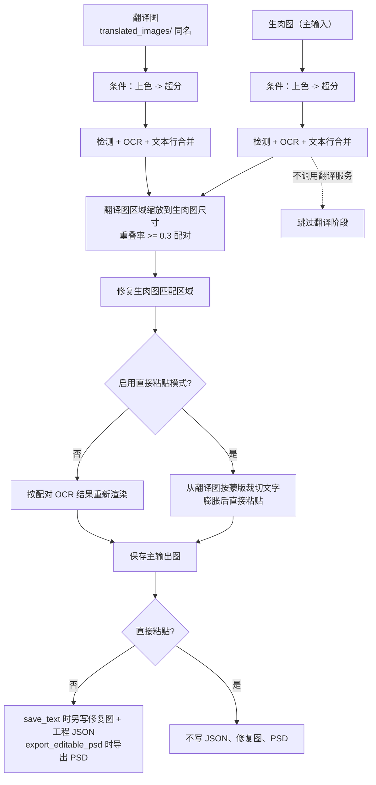

# 替换翻译

当你有一张未翻译的“生肉图”和一张已经翻译好的同作品图片（例如汉化版、修复版或不同分辨率的版本），又缺少可复用的工程 JSON 时，使用“替换翻译”（Replace Translation）工作流。它对生肉图和翻译图分别执行检测与 OCR，按缩放后的区域重叠配对，把翻译图中的译文迁移到生肉图：修复生肉图原文区域后重新渲染，或直接从翻译图裁切文字粘贴。整个过程不调用翻译服务。

本页只描述该工作流的输入、跳过阶段和输出文件。九种工作流的整体边界见[输出目录与工作流](../desktop/translation/output-directory-and-workflow.md)，汇总表见[工作流矩阵](../reference/workflow-matrix.md)；添加文件、列表和拖放见[文件列表与输入](../desktop/translation/file-list-and-input.md)。

## 功能边界

- 输入：主输入图片是生肉图，发现规则与正常翻译相同；每张生肉图必须在同图工作目录 `manga_translator_work/translated_images/` 下放置一张同名翻译图。
- 配对查找：先在 `translated_images/` 中找同扩展名的翻译图，再依次尝试其他受支持的图片扩展名；找不到时该张图跳过并记为失败。
- 执行阶段：对生肉图和翻译图各执行条件上色 → 条件超分 → 检测 → OCR → 文本行合并；把翻译图区域缩放到生肉图尺寸后按重叠率（阈值 `0.3`，以小框为基准）配对；修复生肉图的匹配区域；最后重新渲染或直接粘贴。
- 跳过阶段：翻译服务调用。翻译阶段（`translator`）完全不执行，译文来自翻译图的 OCR 结果。
- 输出文件：主输出图。非直接粘贴且 `save_text=true` 时另写修复图和工程 JSON；直接粘贴时明确不写二者，也不导出 PSD。
- 工作流字段：下拉框索引 8 写入 `cli.replace_translation=true`；GUI 切换保证八个工作流布尔字段互斥。

## UI 操作

### 选择替换翻译工作流

1. 打开翻译页，在“翻译流程模式：”（`Translation Workflow Mode:`）下拉框中选择“替换翻译”（`Replace Translation`）。
2. 页面标题变为“替换翻译”，副标题提示把翻译图放到 `manga_translator_work/translated_images` 并与生肉图同名。
3. 开始按钮变为“开始替换翻译”（`Start Replace Translation`）；点击后按该模式启动后端任务。

选择模式只写入配置并更新界面文案，不会自动开始任务。开始前应添加生肉图，并把与生肉图同名的翻译图放进 `manga_translator_work/translated_images/`。配对优先使用同扩展名文件；`translated_images/` 目录不存在或没有同名图片时，对应生肉图会被跳过并计入失败。

“输出目录:”决定主输出图的位置；修复图、工程 JSON 和配对图始终按输入图片的工作目录规则定位，不随“输出目录:”改变。

| UI 调用 key | English 实际值 | 简体中文实际值 |
| --- | --- | --- |
| `Translation Workflow Mode:` | Translation Workflow Mode: | 翻译流程模式： |
| `Replace Translation` | Replace Translation | 替换翻译 |
| `Start Replace Translation` | Start Replace Translation | 开始替换翻译 |
| `Tip: Place translated images in manga_translator_work/translated_images with matching filenames. The app extracts translated text, matches regions on raw images, inpaints originals, and renders translated text.` | Tip: Place translated images in manga_translator_work/translated_images with matching filenames. The app extracts translated text, matches regions on raw images, inpaints originals, and renders translated text. | 提示：请将翻译图放到 manga_translator_work/translated_images 并与生肉图同名。程序会提取翻译图文字、在生肉图上匹配区域、修复原文字区域，再渲染译文。 |
| `label_enable_template_alignment` | Enable Direct Paste Mode | 启用直接粘贴模式 |
| `label_paste_mask_dilation_pixels` | Paste Mode Mask Dilation Pixels | 粘贴模式蒙版膨胀大小 |
| `label_disable_auto_wrap` | AI Line Breaking | AI断句 |
| `label_layout_mode` | Layout Mode | 排版模式 |
| `layout_mode_strict` | Strict Boundary | 严格边界 |
| `label_save_text` | Editable Image | 图片可编辑 |
| `label_overwrite` | Overwrite Existing Files | 覆盖已存在文件 |
| `label_batch_concurrent` | Concurrent Batch Processing | 并发批量处理 |
| `label_export_editable_psd` | Export Editable PSD | 导出可编辑PSD |

界面提示里的 `manga_translator_work/translated_images` 是程序固定文案和工作目录名，不是用户私有路径；“与生肉图同名”指文件名（不含扩展名）一致。

## 选项中英对照

下拉框没有独立 `userData`，索引就是模式值；运行时代码把索引 8 映射到 `cli.replace_translation=true`。相关设置的存储值如下表，三列 UI 证据与作用并列。

| 存储值 | English | 简体中文 | 本工作流中的实际作用 |
| --- | --- | --- | --- |
| `replace_translation=true` | Replace Translation | 替换翻译 | 进入替换翻译分派，不调用翻译服务 |
| `render.enable_template_alignment=true` | Enable Direct Paste Mode | 启用直接粘贴模式 | 走直接粘贴分支，不写 JSON、修复图和 PSD |
| `render.paste_mask_dilation_pixels=10` | Paste Mode Mask Dilation Pixels | 粘贴模式蒙版膨胀大小 | 直接粘贴时膨胀蒙版：`pixels // 3` 次 3×3 椭圆核迭代，`0` 禁用膨胀 |
| `render.disable_auto_wrap=true` | AI Line Breaking | AI断句 | 本模式强制开启 |
| `render.layout_mode='strict'` | Layout Mode → Strict Boundary | 排版模式 → 严格边界 | 本模式强制为严格边界 |
| `cli.save_text=true` | Editable Image | 图片可编辑 | 非直接粘贴时决定是否写修复图和工程 JSON |
| `cli.overwrite=false` | Overwrite Existing Files | 覆盖已存在文件 | 开始前跳过主输出图已存在的图片 |
| `cli.batch_concurrent=true` | Concurrent Batch Processing | 并发批量处理 | 本模式强制按非并发处理 |
| `cli.export_editable_psd=true` | Export Editable PSD | 导出可编辑PSD | 非直接粘贴时导出 PSD；直接粘贴跳过 |

`render.enable_template_alignment` 和 `render.paste_mask_dilation_pixels` 位于“Mode Specific”分组下的“Replace Translation”分隔线内，设置说明明确为替换翻译专用；其余强制值在替换翻译运行前由 `translate_batch_replace_translation()` 写入运行时配置，用户界面中的既有选择会被覆盖。

## 运行机理

### 输入与配对

`find_translated_image()` 以生肉图路径调用 `get_work_dir()` 得到同图工作目录，再拼接 `translated_images/<stem><ext>`。查找顺序是先同扩展名，后遍历 `SUPPORTED_IMAGE_EXTENSIONS`；因此 `.png` 生肉图可以配 `.jpg` 翻译图，但同名同扩展名永远优先。

配对按以下步骤进行：

1. 对生肉图执行 `_translate_until_translation()`（条件上色 → 条件超分 → 检测 → OCR → 文本行合并），并按 `ocr.prob` 过滤低置信度区域。
2. 对翻译图执行同样的前半段流水线，同样过滤。
3. 把翻译图区域缩放到生肉图尺寸（按宽高比例）。
4. 计算重叠率并以 `iou_threshold=0.3`（以小框为基准）匹配；`create_matched_regions()` 生成用于渲染的配对区域，未匹配上的生肉区域不会被修复。

### 处理阶段与输出

下面的 Mermaid 展示源码确认的双图流水线、两种收尾方式和跳过阶段；它与正常翻译的主要差异是翻译图作为第二输入、不调用翻译服务，以及可选的直接粘贴分支。

限制说明：配对阈值是固定的 `0.3` 重叠率，不以任何用户参数调节；翻译图与生肉图尺寸不同时通过缩放对齐，缩放本身不保证文本位置完美重合，未匹配区域会保留生肉图原文。

### 两种收尾方式

- 重新渲染（默认）：关闭“启用直接粘贴模式”时，把配对后的 OCR 结果作为 `text_regions` 交给 `_run_text_rendering()`，按常规排版参数重新渲染译文；修复图和工程 JSON 在 `save_text=true` 时写出。
- 直接粘贴：开启“启用直接粘贴模式”时，从翻译图取蒙版（优先翻译图的原始蒙版，缺失时用生肉图蒙版），按 `paste_mask_dilation_pixels` 膨胀，再从翻译图裁切文字合成到修复图上，保留翻译图原始字体样式；不写 JSON、修复图和 PSD，`export_editable_psd` 也被忽略。

无论哪种收尾方式，主输出图都会按 `_calculate_output_path()` 保存。

### 跳过与失败路径

- 找不到配对翻译图：该张图跳过并记为失败，不产出主输出图。
- 生肉图未检测到文本区域，或过滤后无有效区域：直接输出原图作为主输出图，不修复、不渲染。
- 翻译图未检测到文本区域：直接输出原图。
- 匹配结果为空（没有需要修复的区域）：保存原图。
- 取消：每一步之间检查 `_check_cancelled()`，停止后不再处理后续图片；每张图处理完立即清理上下文内存。

### 与并发和互斥的关系

- `batch_concurrent` 不兼容：桌面控制层和 `translate_batch()` 都把它视为不兼容模式，强制按非并发处理；界面仍保存并发配置也不会变成并发管线。
- 手工叠加多个工作流字段不是受支持组合。`translate_batch()` 的分派顺序里，替换翻译分支优先于 load_text、translate_json_only 和常规预处理；GUI 切换时八个字段互斥。
- 与正常翻译一样，预处理阶段仍会按 `colorizer.colorizer` 和 `upscale.upscale_ratio` 对两张图执行条件上色与超分；这些值不是本工作流的强制开关。

## 依赖与冲突

- 翻译图依赖：`translated_images/` 目录缺失、目录存在但没有同名文件，都会跳过该张图。配对图与生肉图不同名、不同分辨率或文本位置偏差过大时，配对结果会变少，未匹配区域保留原文。
- `render.enable_template_alignment`：设置说明明确为替换翻译专用；开启走直接粘贴，不写 JSON、修复图或 PSD；关闭时以 OCR 得到的配对区域重新渲染。
- `cli.save_text=false`：非直接粘贴时不写修复图和工程 JSON，只保留主输出图；直接粘贴本来就不写二者。
- `cli.overwrite=false`：GUI 开始前按“普通翻译”分支检查主输出图是否已存在，存在则跳过该张图。
- 蒙版细化：修复阶段按 `inpainter` 配置选择模型；修复模型为 `none` 时使用替换翻译专用检测模块重新取原始蒙版并用 `REFINEMASK_INPAINT` 精炼，否则走常规 `_run_mask_refinement`，随后按 `mask_dilation_offset` 做额外膨胀。
- 上色、超分、检测、OCR 仍按所选参数产生模型、显存和网络成本；本页不重复其参数说明。
- 主输出目录、`save_to_source_dir`、`cli.format` 只影响主输出图；JSON、修复图和配对图不受影响。

## 关联文件与格式

| 文件/格式 | 本页实际作用 | 说明 |
| --- | --- | --- |
| `manga_translator_work/translated_images/<stem><ext>` | 替换翻译的配对翻译图 | 先同扩展名，后遍历受支持的图片扩展名 |
| 主输出图 `<output-dir>/<stem>.<format>` | 替换翻译的主要产物 | 路径由 `_calculate_output_path()` 决定 |
| `manga_translator_work/inpainted/<stem>_inpainted.<原图扩展名>` | 修复图（非直接粘贴且 `save_text=true`） | 无其他查找位置 |
| `manga_translator_work/json/<stem>_translations.json` | 工程 JSON（非直接粘贴且 `save_text=true`） | 含配对后的区域、蒙版等字段 |
| `manga_translator_work/psd/<stem>.psd` | 可编辑 PSD（`export_editable_psd` 且非直接粘贴） | 直接粘贴时跳过 |
| 调试产物 | `replace_debug_match.jpg`、`debug_extracted_text.png`、`inpainted.png` | `verbose` 时写入；含匹配框/重叠信息和抽取文字 |

不在本页展示真实用户配置、密钥、令牌、用户名、私有绝对路径、用户图片或任务产物。

## 源码依据 {#source-evidence}

| 层级 | 文件 | 本页核对内容 |
| --- | --- | --- |
| 工作流选择与写入 | `desktop_qt_ui/ui/main_page/runtime.py:183-215` | 索引 8 → `replace_translation=true`、八字段互斥和配置保存 |
| 标题、提示与开始按钮 | `desktop_qt_ui/ui/main_page/runtime.py:22-47,219-238` | “替换翻译”标题、提示调用 key 和按钮文案 |
| i18n | `desktop_qt_ui/locales/en_US.json`、`zh_CN.json` | `Replace Translation`、`Start Replace Translation`、提示和 `label_*` 实际双语值 |
| 控制层 | `desktop_qt_ui/app_logic.py:3140-3272` | 覆盖前主输出图检查、模式判定和特殊模式并发禁用 |
| 核心分派 | `manga_translator/manga_translator.py:3436-3440,5569-5586` | 替换翻译优先分派与批量入口 |
| 双图流水线 | `manga_translator/utils/replace_translation.py:128-697` | 双图检测/OCR、配对、修复、直接粘贴/重新渲染、保存边界 |
| 配对查找 | `manga_translator/utils/replace_translation.py:726-767` | 同扩展名优先、遍历 `SUPPORTED_IMAGE_EXTENSIONS` |
| 区域匹配 | `manga_translator/utils/replace_translation.py:938-1120` | 缩放、重叠率阈值 `0.3`、`create_matched_regions` |
| 配置 | `manga_translator/config.py:204-211,422` | `enable_template_alignment`、`paste_mask_dilation_pixels`、`replace_translation` 默认值 |
| 路径 | `manga_translator/utils/path_manager.py` | 每图工作目录、`translated_images/`、JSON/修复图/PSD 路径 |
| 渲染/布局 | `manga_translator/rendering/__init__.py:1121` | `cli.replace_translation` 在渲染器的特殊处理 |

## 验证记录 {#verification}

| 验证内容 | 状态 | 说明 |
| --- | --- | --- |
| BLUEPRINT、PAGE_GUIDELINES、TODO | 完成 | 已完整读取并按页面合同编写；不修改三份合同文件 |
| 源码与研究资料 | 完成 | 已核对 `workflow-matrix-source-evidence.md` 与 UI、i18n、控制层和核心源码 |
| i18n 三列证据 | 完成 | 工作流选项、提示、按钮和相关设置均记录调用 key、English、简体中文实际值 |
| 路由/页面镜像 | 待运行 | 完成页面后运行 route mirror 和 source evidence 检查 |
| 运行态验证 | 待运行 | 直接粘贴与重新渲染两条分支的实际输出、不同尺寸配对、无配对图/无匹配区域、JSON/修复图/PSD 写入差异、取消后的保留文件需脱敏运行验证 |
| 生产构建 | 待运行 | 必要时运行 `npm run docs:build --prefix doc/wiki` |

- [ ] [进行中] 运行态待确认：直接粘贴与重新渲染的实际文件写入、跳过路径的保留文件、错误提示和取消行为。
