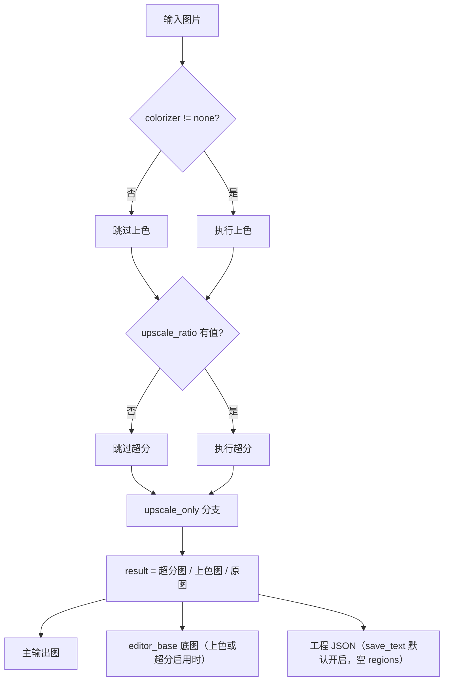

# 仅超分

当只需要批量放大图片（例如为后续人工修图、打印或存档提高分辨率），不需要检测、OCR、翻译、修复和排版渲染时，使用“仅超分”工作流。它把每张输入图片送入超分模型后直接写出主输出图，不生成翻译文本，也不走蒙版、修复和渲染阶段。

“仅超分”与“仅上色”“仅修复”同属旁路工作流：它们都跳过翻译链路的后半段，区别只在保留哪个前置阶段。九种工作流的整体边界见[输出目录与工作流](../desktop/translation/output-directory-and-workflow.md)，汇总表见[工作流矩阵](../reference/workflow-matrix.md)；超分模型、倍率、分块等参数说明见[超分与上色](../desktop/settings/upscale-and-colorization.md)。

## 功能边界

- 输入：主输入图片（与正常翻译相同的文件发现规则：添加文件、添加文件夹或拖放，文件夹递归查找并按自然排序，跳过名为 `manga_translator_work` 的目录）。
- 执行阶段：上色（条件）→ 超分（条件）。`colorizer.colorizer` 不为 `none` 时先执行上色；`upscale.upscale_ratio` 有值时执行超分。
- 跳过阶段：检测、OCR、文本行合并、翻译、蒙版细化、修复、排版渲染。`upscale_only` 分支把 `text_regions` 置为空列表，不进入翻译与渲染分支。
- 输出文件：主输出图（由输出路径计算决定，见“关联文件与格式”）；上色或超分任一启用时还写入编辑器底图 `manga_translator_work/editor_base/<原始文件名>`。
- 工作流字段：下拉框第 6 项（索引 6），运行时写入 `cli.upscale_only=true`；GUI 切换时八个工作流布尔字段互斥。

“仅超分”不会强制倍率：`upscale_only=true` 只决定跳过哪些阶段，是否真的放大由 `upscale_ratio` 决定。倍率为空时输出就是上色结果（上色器开启时）或原图。源代码也不会在该模式自动关闭上色，因此界面提示“仅对图片进行超分处理”与上色器已开启时的实际前置上色不完全一致。

## UI 操作

### 选择仅超分工作流

1. 打开翻译页，在“翻译流程模式：”（`Translation Workflow Mode:`）下拉框中选择“仅超分”（`Upscale Only`）。
2. 页面标题变为“仅超分”，副标题显示提示：仅对图片进行超分处理，不进行检测、OCR、翻译和渲染。
3. 开始按钮变为“开始超分”（`Start Upscaling`）；点击后按该模式启动后端任务。

选择模式只写入配置并更新界面文案，不会自动开始任务。开始前应先添加主输入图片（“添加文件…”“添加文件夹…”或拖放），并按需在“设置 → Mode Specific → Upscaling”中选择超分模型与倍率；倍率保持“不使用”时本模式不会改变图像。

| UI 调用 key | English 实际值 | 简体中文实际值 |
| --- | --- | --- |
| `Translation Workflow Mode:` | Translation Workflow Mode: | 翻译流程模式： |
| `Upscale Only` | Upscale Only | 仅超分 |
| `Tip: Only upscale images, no detection, OCR, translation or rendering` | Tip: Only upscale images, no detection, OCR, translation or rendering | 提示：仅对图片进行超分处理，不进行检测、OCR、翻译和渲染 |
| `Start Upscaling` | Start Upscaling | 开始超分 |
| `label_upscaler` | Upscaling Model | 超分模型 |
| `label_upscale_ratio` | Upscale Ratio | 超分倍数 |
| `upscale_ratio_not_use` | Not Use | 不使用 |
| `label_tile_size` | Tile Size (0=No Split) | 分块大小(0=不分割) |
| `label_revert_upscaling` | Revert Upscaling | 还原超分 |
| `label_colorizer` | Colorization Model | 上色模型 |
| `label_overwrite` | Overwrite Existing Files | 覆盖已存在文件 |
| `label_save_text` | Editable Image | 图片可编辑 |
| `label_batch_concurrent` | Concurrent Batch Processing | 并发批量处理 |

## 选项中英对照

下拉框没有独立 `userData`，索引就是模式值；运行时代码把索引 6 映射到 `cli.upscale_only=true`。相关设置的存储值如下表，三列 UI 证据与在本工作流中的实际作用并列。

| 存储值 | English | 简体中文 | 本工作流中的实际作用 |
| --- | --- | --- | --- |
| `upscale_only=true` | Upscale Only | 仅超分 | 进入仅超分分支，跳过检测、OCR、翻译、修复和渲染 |
| `upscale_ratio=null`（“不使用”） | Not Use | 不使用 | 不执行超分，输出为原图或前置上色结果 |
| `upscale_ratio=2/3/4` | 2 / 3 / 4 | 2 / 3 / 4 | 按整数倍放大 |
| `upscale_ratio=x2/x4/DAT2 x4` | x2 / x4 / DAT2 x4 | x2 / x4 / DAT2 x4 | MangaJaNai 字符串档位，同时决定模型名 |
| `upscaler` | Upscaling Model | 超分模型 | 选择 waifu2x、ESRGAN、4x UltraSharp、Real-CUGAN、MangaJaNai |
| `tile_size=0` | Tile Size (0=No Split) | 分块大小(0=不分割) | 0 关闭分块；空值用运行时默认 400；正数按瓦片推理 |
| `revert_upscaling=true` | Revert Upscaling | 还原超分 | 超分后恢复输入宽高（仍会执行超分） |
| `colorizer`（非 `none`） | Colorization Model | 上色模型 | 本模式不会自动关闭上色；开启时先上色再超分 |
| `overwrite=false` | Overwrite Existing Files | 覆盖已存在文件 | 开始前跳过主输出图已存在的图片 |
| `save_text=true` | Editable Image | 图片可编辑 | GUI/发行默认开启；批处理循环会在仅超分后回写工程 JSON |
| `batch_concurrent=true` | Concurrent Batch Processing | 并发批量处理 | 本模式强制按非并发处理 |

## 运行机理

### 处理分支与输出

桌面任务经 `translate_batch()` 进入标准或高质量批处理循环，每张图调用 `_translate_until_translation()` 完成条件上色与条件超分；`upscale_only` 分支在超分完成后直接返回 `ctx.result = ctx.upscaled`，后续的检测、OCR、翻译和渲染阶段被整体跳过。

上图是源码确认的仅超分实际分支，不是“配置 → 算法 → 输出”的通用框：倍率为空时输出仍是上色图或原图；编辑器底图只在 `colorizer != none` 或 `upscale_ratio` 有值时才写入；工程 JSON 的写入取决于 `cli.save_text`/`text_output_file`（见“依赖与冲突”），并以脱敏运行验证为准。本模式不会因为界面仍保存并发配置就变成并发管线。

## 依赖与冲突

- `upscale_only=true` 不强制倍率：`upscale_ratio` 为“不使用”（`null`）时输出为上色结果或原图；界面提示与代码实际行为不完全一致（代码不会自动关闭上色）。
- 上色前置：`colorizer.colorizer` 非 `none` 时，仅超分也会先执行上色，产生模型、显存和 API 成本；倍率为空时输出保留该上色结果。
- `revert_upscaling` 只恢复输出尺寸，不取消超分；超分后的图像先放大再缩小，仍会产生超分计算。
- `tile_size=0` 只关闭分块，不等于关闭超分；空值使用运行时默认 400。
- `cli.overwrite=false`：GUI 开始前按主输出图检查（“普通模式”分支），主输出图已存在则跳过该图片。
- `cli.save_text`：GUI/发行默认 `true`。批处理循环在 `save_text` 或 `text_output_file` 开启时，即使 `text_regions` 为空也会调用 `_save_text_to_file`，因此默认配置下仅超分还会写出含空 `regions` 的工程 JSON（记录 `upscale_ratio`、`upscaler` 与 `last_export_dir`）。研究矩阵只列出主图和编辑器底图两种输出，实际文件保留需脱敏运行验证。
- `batch_concurrent` 不兼容：桌面控制层与 `translate_batch()` 都把仅超分视为不兼容模式，强制按非并发处理。
- 手工叠加多个工作流字段不是受支持组合；GUI 切换时八个字段互斥，核心分派也不以多字段叠加为准。
- 主输出目录、`save_to_source_dir`、`cli.format` 决定主输出图位置与扩展名；JSON 与编辑器底图始终按输入图片的工作目录规则写入，不受输出目录影响。
- 本模式不渲染，因此不写 `skip_text_replacements`；已有 JSON 中的画笔/印章图层会被保留。

## 关联文件与格式

| 文件/格式 | 本页实际作用 | 说明 |
| --- | --- | --- |
| 主输出图 | 超分/上色后的最终图片 | 位置由 `_calculate_output_path` 决定：输出目录下保留输入文件夹相对层级；`save_to_source_dir=true` 时写入原图同级 `manga_translator_work/result/`；`cli.format` 为空或 `none` 时保留原扩展名 |
| `manga_translator_work/editor_base/<原始文件名>` | 编辑器专用上色/超分底图 | 仅 `colorizer != none` 或 `upscale_ratio` 有值时写入；兼容旧工作目录根部的同名底图 |
| `manga_translator_work/json/<stem>_translations.json` | 工程 JSON（默认配置下回写） | 含空 `regions`、`upscale_ratio`/`upscaler`、`last_export_dir`；新位置优先，回退图片同级旧位置 |
| `config/config.json`、`config/config-example.json` | `upscale`、`colorizer` 等配置来源 | 只记录字段边界，不展示真实用户配置 |
| verbose 调试产物 | 仅超分不调用检测/OCR/翻译/修复/渲染 | verbose 下仍可能写出 `input.png` 等通用调试文件；完整清单见[调试产物索引](../reference/debug-artifact-index.md) |

不在本页展示真实用户配置、密钥、令牌、用户名、私有绝对路径、用户图片或任务产物。

## 源码依据 {#source-evidence}

| 层级 | 文件 | 本页核对内容 |
| --- | --- | --- |
| 工作流选择与写入 | `desktop_qt_ui/ui/main_page/runtime.py:183-216` | 索引 6 → `upscale_only=true`、八字段互斥和配置保存 |
| 标题、提示与开始按钮 | `desktop_qt_ui/ui/main_page/runtime.py:22-47,219-238` | “Upscale Only”标题、提示调用 key 和“Start Upscaling”按钮文案 |
| i18n | `desktop_qt_ui/locales/en_US.json`、`zh_CN.json` | `Upscale Only`、`Start Upscaling`、提示与 `label_*` 实际双语值 |
| 控制层 | `desktop_qt_ui/app_logic.py:3125-3210,3212-3238,3240-3285` | 主输出图覆盖检查、工作流提示、仅超分并发禁用 |
| 核心分派 | `manga_translator/manga_translator.py:3399,3479-3503,4104-4106,4194-4207` | 特殊模式互斥、跳过翻译与渲染、批处理分支 |
| 预处理与仅超分分支 | `manga_translator/manga_translator.py:4236-4366` | 条件上色、条件超分、`upscale_only` 直接返回、编辑器底图 |
| 输出路径 | `manga_translator/manga_translator.py:540` | 主输出图路径计算、相对层级、`save_to_source_dir`、`cli.format` |
| 编辑器底图 | `manga_translator/manga_translator.py:1079`、`manga_translator/utils/path_manager.py:102` | `_save_editor_base_if_needed` 与 `editor_base` 路径 |
| JSON 回写 | `manga_translator/manga_translator.py:713` | 空 `regions` 也写 JSON、`upscale_ratio`/`upscaler` 记录 |
| 输入发现 | `desktop_qt_ui/services/file_service.py:31` | 支持扩展名、递归、自然排序和工作目录排除 |
| 配置默认 | `desktop_qt_ui/core/config_models.py:111-115,133,142`、`manga_translator/config.py:250-260`、`config/config-example.json` | Qt/核心/发行三类默认值差异 |

## 验证记录 {#verification}

| 验证内容 | 状态 | 说明 |
| --- | --- | --- |
| BLUEPRINT、PAGE_GUIDELINES、TODO | 完成 | 已完整读取并按页面合同编写；不修改三份合同文件 |
| 源码与研究资料 | 完成 | 已核对 `workflow-matrix-source-evidence.md` 与 UI、i18n、控制层和核心源码 |
| i18n 三列证据 | 完成 | 工作流选项、提示、按钮和相关设置均记录调用 key、English、简体中文实际值 |
| 路由/页面镜像 | 待运行 | 完成页面后运行 route mirror 和 source evidence 检查 |
| 空倍率/上色前置/JSON 保留 | 待运行 | 倍率为空、上色器开启、`save_text` 下的实际输出文件需脱敏运行验证 |
| 生产构建 | 待运行 | 必要时运行 `npm run docs:build --prefix doc/wiki` |

- [ ] [进行中] 运行态待确认：仅超分在倍率为空、上色器开启和 `save_text` 默认开启时的实际输出文件与界面反馈。