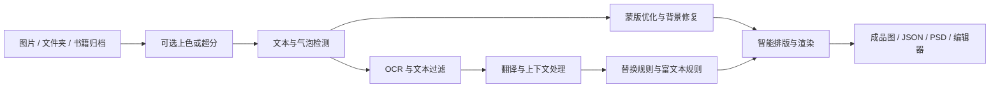

# Manga Translator UI 3.0 Wiki

欢迎来到 **Manga Translator UI** 文档库。

Manga Translator UI 是一套面向漫画与图像翻译的 PyQt6 桌面工作台，覆盖文本检测、OCR、翻译、去字修复、排版渲染、批量返修和可视化校对；同一仓库还提供 Local CLI、多人 Web 服务与 Docker 部署方式。

> [!IMPORTANT]
> 本 Wiki 对应正在开发的 Manga Translator UI 3.0，以当前 Qt 界面和实际程序行为为准。

---

## 核心特性

| 模块 | 3.0 当前能力 |
| :--- | :--- |
| **完整翻译流水线** | 文本检测、OCR、OpenAI/Gemini/Sakura 翻译、蒙版优化、LaMa 系列修复与 Qt/AI 渲染 |
| **9 种桌面工作流** | 普通翻译、原文/译文导出、仅翻译 JSON、导入并渲染、仅上色、仅超分、仅修复和替换翻译 |
| **可视化编辑器** | 文本框、蒙版、画笔层、独立印章层、仿制印章、中心点缩放、对齐分布和串行导出 |
| **结构化富文本** | `richtext.v1`、Ruby 注音、TCY 纵中横、局部字体/颜色/描边/发光/间距/旋转与镜像 |
| **规则与批量管理** | OCR 过滤、文本替换、富文本规则、跨 JSON 条件筛选、动作预览、原子写回和 `.bak` 恢复 |
| **高可用 API 管理** | 多通道故障转移与轮询、冷却/禁用状态、手动恢复，以及按模型配置自定义参数 |
| **多入口运行** | Qt 桌面端、Local CLI、FastAPI Web、多用户管理、REST API 和 CPU/NVIDIA Docker 服务 |

> [!NOTE]
> 当前实际注册的翻译器为 OpenAI、OpenAI HQ、Gemini、Gemini HQ、Sakura、None 和 Original。旧 Wiki 中出现的 Claude、DeepL、Google Translate 等名称不属于当前可选翻译器。

---

## 整体处理流程

不同工作流会跳过或替换其中部分阶段。例如“仅修复”不翻译和排字，“仅翻译 JSON”复用已有区域数据，“导入翻译并渲染”读取已校对文本，“替换翻译”从同名译图提取或粘贴文字。

---

## 文档目录

### 用户手册

1. [[快速开始|01-快速开始]]：安装、配置 API、完成第一次翻译和检查结果。
2. [[翻译界面|02-翻译界面]]：输入文件树、排除项、输出目录、任务状态与启停。
3. [[工作流详解|03-工作流详解]]：普通翻译、文本往返、图像处理和替换翻译共 9 种流程。
4. [[参数设置|04-参数设置]]：General、OCR、Detection、Translation、Inpainting、Typesetting 和模式参数。
5. [[API 管理|05-API管理]]：四类 API 标签、多通道轮换、测试、状态恢复、预设和自定义参数。
6. [[提示词与规则|06-提示词与规则]]：翻译/功能提示词、OCR 过滤、替换规则、富文本规则和导出模板。
7. [[批量管理|07-批量管理]]：方案、条件、动作、可选择预览、原子写回和 `.bak` 恢复。
8. [[可视化编辑器|08-可视化编辑器]]：文本框、图层、仿制印章、富文本、排列、快捷键与导出。
9. [[文件与目录说明|09-文件与目录说明]]：图片/归档格式、工作目录、JSON、overlay、模板和中间文件。
10. [[常见问题|10-常见问题]]：入口选择、离线使用、兼容接口、JSON 往返和编辑保存。

### 高级附录

11. [[命令行使用|11-命令行使用]]：Local、Web、WS、Shared 模式和内存管理参数。
12. [[Web 服务与 Docker|12-Web服务与Docker]]：首次管理员设置、鉴权、REST API、权限和容器部署。
13. [[故障排查|13-故障排查]]：启动、GPU、模型、API、归档、Web 和 Docker 问题。
14. [[开发者指南|14-开发者指南]]：模块职责、配置扩展、测试、构建与贡献约定。

---

## 推荐阅读路线

| 目标 | 阅读顺序 |
| :--- | :--- |
| 第一次使用 | [快速开始](./01-快速开始) → [翻译界面](./02-翻译界面) → [工作流详解](./03-工作流详解) |
| 汉化组两阶段协作 | [工作流详解](./03-工作流详解) → [批量管理](./07-批量管理) → [可视化编辑器](./08-可视化编辑器) |
| 调整识别、去字和排版 | [参数设置](./04-参数设置) → [故障排查](./13-故障排查) |
| 部署多人服务 | [API 管理](./05-API管理) → [Web 服务与 Docker](./12-Web服务与Docker) |
| 自动化或二次开发 | [命令行使用](./11-命令行使用) → [开发者指南](./14-开发者指南) |

---

## 使用前须知

- 用户处理设置保存在 `config/config.json`，API 密钥和地址保存在根目录 `.env`；不要把真实密钥提交到公共仓库。
- `manga_translator_work/` 保存区域 JSON、译文、蒙版和修复底图。需要校对、重渲染或恢复编辑状态时，应与原图一起备份。
- 首次使用本地检测、OCR、修复、超分或上色模型时可能下载权重；模型与字体可能采用独立许可证。
- AI OCR、AI 上色、AI 渲染及远程翻译会把文本或图片发送到所配置的服务端，请确认第三方接口的隐私策略。
- 遇到错误先保留 `result/log_*.txt`，再按 [[故障排查|13-故障排查]] 缩小问题范围。
